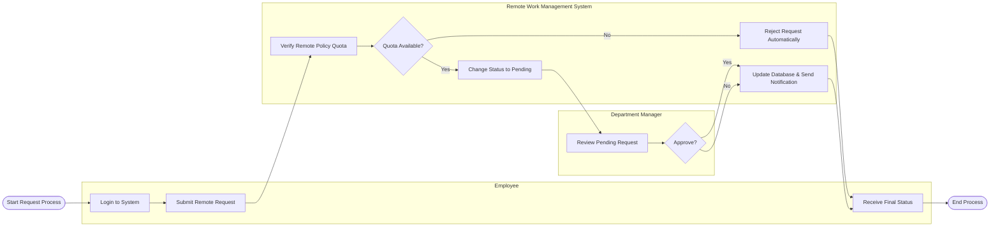

# Swimlane Diagram — Remote Work Management System

## Mermaid Code

## Flow Description | Mo ta luong

| Lane | Actor | Role in Flow |
|------|-------|-------------|
| 1 | Employee | Nguoi chu dong tao yeu cau lam viec tu xa tren he thong va nhan thong bao ket qua. |
| 2 | Remote Work Management System | He thong tu dong kiem tra dieu kien chinh sach (so ngay con lai), quan ly trang thai va thong bao. |
| 3 | Department Manager | Nguoi quan ly nhan duoc thong bao, vao xem xet va ra quyet dinh duyet hoac tu choi yeu cau. |
