# Action Tree — Remote Work Management System

## Mermaid Code

```mermaid
%%{init: {'theme': 'default'}}%%
graph TD
    Root["Remote Work Management System"]

    Root --> M1["Profile & Setup"]
    Root --> M2["Request Management"]
    Root --> M3["Time & Attendance"]
    Root --> M4["Productivity Tracking"]
    Root --> M5["System Administration"]

    M1 --> A11["Update Home Address"]
    M1 --> A12["Register IP Address"]
    M1 --> A13["Set Emergency Contacts"]

    M2 --> A21["Submit Remote Request"]
    M2 --> A22["Approve Remote Request"]
    M2 --> A23["Request Home Equipment"]
    M2 --> A24["Approve Equipment"]

    M3 --> A31["Web Check-in/out"]
    M3 --> A32["View Timesheets"]
    M3 --> A33["Generate Attendance Report"]

    M4 --> A41["Submit Daily Task Report"]
    M4 --> A42["Review Team Productivity"]
    M4 --> A43["Monitor Active Status"]

    M5 --> A51["Configure Remote Policies"]
    M5 --> A52["Manage User Accounts"]
    M5 --> A53["Export Compliance Data"]
```

## Module Description | Mo ta Module

| # | Module | Description | Actions |
|---|--------|-------------|---------|
| 1 | Profile & Setup | Thiet lap ho so lam viec tu xa cua nhan vien | Update Home Address, Register IP Address, Set Emergency Contacts |
| 2 | Request Management | Quan ly cac don xin lam tu xa va muon thiet bi | Submit Remote Request, Approve Remote Request, Request Home Equipment, Approve Equipment |
| 3 | Time & Attendance | Ghi nhan thoi gian lam viec thuc te khi o nha | Web Check-in/out, View Timesheets, Generate Attendance Report |
| 4 | Productivity Tracking | Theo doi tien do va khoi luong cong viec hang ngay | Submit Daily Task Report, Review Team Productivity, Monitor Active Status |
| 5 | System Administration | Quan tri he thong, phan quyen va chinh sach | Configure Remote Policies, Manage User Accounts, Export Compliance Data |
