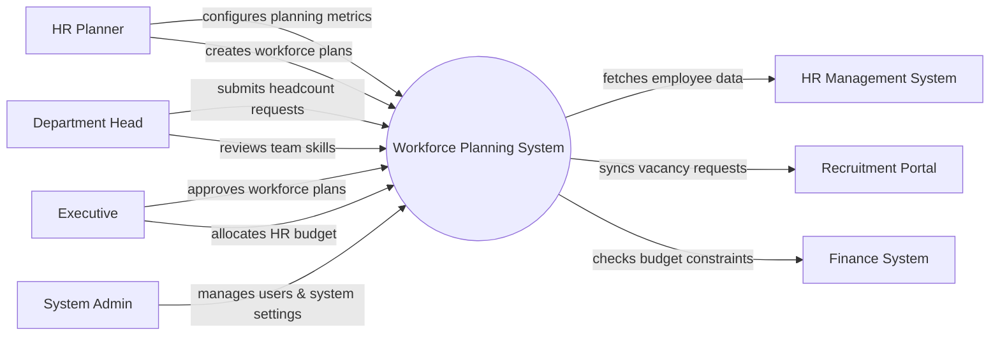

# Context Diagram — Workforce Planning System

## Mermaid Code

## Actor & Interaction Table | Bang Actor & Tuong tac

| # | Actor | Actor Type | Data Sent TO System | Data Received FROM System | Notes |
|---|-------|------------|---------------------|---------------------------|-------|
| 1 | HR Planner | Primary | Workforce plans, planning metrics | Analytics reports, skill gap data | Chuyen vien hoach dinh nhan su |
| 2 | Department Head | Primary | Headcount requests, skill assessments | Team workforce status | Truong bo phan |
| 3 | Executive | Primary | Plan approvals, budget allocations | High-level workforce reports | Ban Giam doc |
| 4 | System Admin | Primary | System configurations, user roles | System logs, audit reports | Quan tri he thong |
| 5 | HR Management System | Supporting | Employee profiles, current roles | Workforce plan updates | He thong quan ly nhan su |
| 6 | Recruitment Portal | Supporting | Hiring pipeline status | New vacancy requests | Cong tuyen dung |
| 7 | Finance System | Supporting | Budget limits, financial constraints | Labor cost forecasts | He thong tai chinh |

## System Boundary Description | Mo ta Pham vi He thong

The Workforce Planning System (WPS) is designed to forecast future staffing needs, analyze current workforce capabilities, and identify skill gaps. It provides tools for HR Planners and Executives to formulate and approve long-term headcount plans. The system does not directly manage daily HR operations or recruit candidates; rather, it integrates with the HR Management System for employee data and the Recruitment Portal to initiate hiring. Additionally, it interacts with the Finance System to ensure workforce plans align with organizational budgets.
