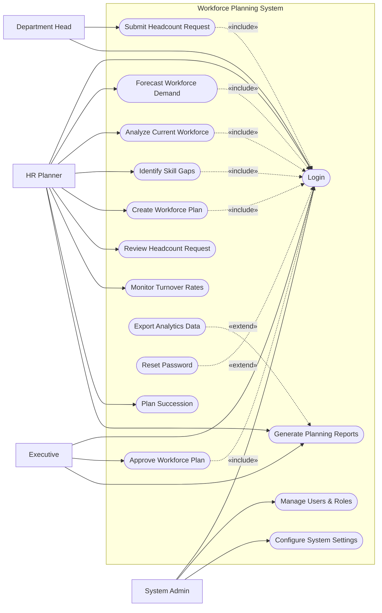

# Use Case Diagram — Workforce Planning System

## Mermaid Code

## Actor Table | Bang Actor

| # | Actor | Actor Type | Role Description | Related Use Cases |
|---|-------|------------|------------------|-------------------|
| 1 | HR Planner | Primary | Nguoi chiu trach nhiem phan tich va lap ke hoach nhan su | UC01, UC02, UC03, UC04, UC05, UC07, UC09, UC10, UC11 |
| 2 | Department Head | Primary | Nguoi yeu cau nhan su moi cho bo phan cua minh | UC01, UC06 |
| 3 | Executive | Primary | Ban Giam doc phe duyet ke hoach va ngan sach | UC01, UC08, UC11 |
| 4 | System Admin | Primary | Quan tri vien he thong, phan quyen va cai dat | UC01, UC13, UC14 |

## Use Case Table | Bang Use Case

| # | UC ID | Use Case Name | Primary Actor | Secondary Actor | Description | Priority |
|---|-------|---------------|---------------|-----------------|-------------|----------|
| 1 | UC01 | Login | HR Planner | | Authenticate user access | High |
| 2 | UC02 | Forecast Workforce Demand | HR Planner | | Predict future staffing requirements | High |
| 3 | UC03 | Analyze Current Workforce | HR Planner | HRMS | Assess existing employee capabilities | High |
| 4 | UC04 | Identify Skill Gaps | HR Planner | | Compare current skills with future needs | High |
| 5 | UC05 | Create Workforce Plan | HR Planner | | Draft a comprehensive headcount strategy | High |
| 6 | UC06 | Submit Headcount Request | Department Head| | Request new roles for the department | Medium |
| 7 | UC07 | Review Headcount Request | HR Planner | | Evaluate department staffing requests | Medium |
| 8 | UC08 | Approve Workforce Plan | Executive | Finance System | Authorize the finalized workforce plan | High |
| 9 | UC09 | Monitor Turnover Rates | HR Planner | | Track employee retention and attrition | Medium |
| 10| UC10 | Plan Succession | HR Planner | | Identify successors for critical roles | Medium |
| 11| UC11 | Generate Planning Reports | HR Planner | | Create statistical forecasting reports | Medium |
| 12| UC12 | Export Analytics Data | HR Planner | | Download data to Excel or PDF | Low |
| 13| UC13 | Manage Users & Roles | System Admin | | Create or deactivate user accounts | High |
| 14| UC14 | Configure System Settings | System Admin | | Update overall system parameters | Medium |
| 15| UC15 | Reset Password | HR Planner | | Recover forgotten account password | Medium |

## Use Case Specification | Dac ta Use Case

---

### UC01 — Login

| Field | Detail |
|-------|--------|
| **UC ID** | UC01 |
| **Use Case Name** | Login |
| **Actor(s)** | Primary: HR Planner, Department Head, Executive, System Admin |
| **Description** | Cho phep nguoi dung xac thuc de dang nhap vao he thong. |
| **Precondition** | 1. Nguoi dung phai co tai khoan hop le tren he thong.  2. He thong dang hoat dong binh thuong. |
| **Main Flow** | 1. Actor mo trang dang nhap.  2. System hien thi form dang nhap.  3. Actor nhap username va password.  4. Actor nhan nut Submit.  5. System xac thuc thong tin.  6. System chuyen huong den Dashboard tuong ung quyen han. |
| **Alternative Flow** | **AF1** — Quen mat khau: Neu Actor chon "Forgot Password", System kich hoat UC15 Reset Password. |
| **Exception Flow** | **EX1** — Sai thong tin: Neu xac thuc that bai, System hien thi thong bao loi va yeu cau nhap lai.  **EX2** — Tai khoan bi khoa: Neu nhap sai qua 5 lan, System khoa tai khoan. |
| **Postcondition** | Nguoi dung duoc dang nhap va phien lam viec duoc khoi tao. |
| **Business Rule** | **BR1**: Mat khau phai duoc ma hoa.  **BR2**: Phien dang nhap tu dong het han sau 30 phut khong hoat dong. |

---

### UC02 — Forecast Workforce Demand

| Field | Detail |
|-------|--------|
| **UC ID** | UC02 |
| **Use Case Name** | Forecast Workforce Demand |
| **Actor(s)** | Primary: HR Planner |
| **Description** | Du bao nhu cau nhan su tuong lai dua tren du lieu lich su va muc tieu kinh doanh. |
| **Precondition** | 1. HR Planner da dang nhap (Include UC01).  2. He thong da dong bo du lieu hien tai tu HRMS. |
| **Main Flow** | 1. Actor chon "Demand Forecasting".  2. System hien thi cong cu du bao.  3. Actor nhap cac thong so tang truong, ty le nghi viec du kien.  4. Actor nhan "Generate Forecast".  5. System tinh toan dua tren thuat toan.  6. System hien thi bieu do bieu dien nhu cau nhan su theo thoi gian. |
| **Alternative Flow** | **AF1** — Luu kich ban: Actor chon "Save Scenario" de luu lai ket qua du bao lam phuong an so sanh. |
| **Exception Flow** | **EX1** — Thieu du lieu: Neu khong du du lieu lich su, System bao loi "Insufficient data for accurate forecast". |
| **Postcondition** | Ban du bao nhu cau duoc tao va luu vao he thong. |
| **Business Rule** | **BR1**: Du bao chi co the thuc hien cho chu ky toi da 5 nam.  **BR2**: Ty le nghi viec phai duoc tinh duong (lon hon 0). |

---

### UC05 — Create Workforce Plan

| Field | Detail |
|-------|--------|
| **UC ID** | UC05 |
| **Use Case Name** | Create Workforce Plan |
| **Actor(s)** | Primary: HR Planner |
| **Description** | Xay dung ban ke hoach nhan su tong thể dua tren lo hong ky nang va nhu cau tuong lai. |
| **Precondition** | 1. HR Planner da dang nhap (Include UC01).  2. Da co ket qua tu UC02 va UC04. |
| **Main Flow** | 1. Actor chon "New Workforce Plan".  2. System tao mot ban ke hoach trong va hien thi form nhap lieu.  3. Actor chon chu ky (vi du: Nam 2027), gan muc tieu tuyen dung va ngan sach du kien.  4. Actor luu ban nhap (Draft).  5. Actor nhan "Submit for Approval".  6. System chuyen trang thai ke hoach sang "Pending Approval" va gui thong bao cho Executive. |
| **Alternative Flow** | **AF1** — Huy tao: Actor chon "Cancel", System quay lai danh sach khong luu thay doi. |
| **Exception Flow** | **EX1** — Vuot ngan sach: Neu chi phi tinh toan vuot qua gioi han cho phep, System canh bao nhung van cho phep nop don. |
| **Postcondition** | Ke hoach duoc luu va nam o trang thai cho duyet. |
| **Business Rule** | **BR1**: Mot chu ky chi co mot ke hoach nhan su chinh thuc.  **BR2**: Ke hoach phai quy dinh ro so luong headcount moi cho tung phong ban. |

---

### UC08 — Approve Workforce Plan

| Field | Detail |
|-------|--------|
| **UC ID** | UC08 |
| **Use Case Name** | Approve Workforce Plan |
| **Actor(s)** | Primary: Executive |
| **Description** | Ban Giam doc xem xet va phe duyet ke hoach nhan su do HR Planner trinh len. |
| **Precondition** | 1. Executive da dang nhap (Include UC01).  2. Co it nhat 1 ke hoach dang cho duyet (Pending Approval). |
| **Main Flow** | 1. Actor chon vao "Pending Approvals".  2. System hien thi danh sach ke hoach can duyet.  3. Actor chon xem chi tiet mot ke hoach.  4. System hien thi thong so du kien, chi phi va bieu do.  5. Actor nhan "Approve".  6. System cap nhat trang thai thanh "Approved" va gui thong bao den HR Planner. |
| **Alternative Flow** | **AF1** — Tu choi: O buoc 5, Actor chon "Reject" va nhap ly do. System cap nhat trang thai "Rejected". |
| **Exception Flow** | **EX1** — Ke hoach da duoc xu ly: Neu ke hoach da duoc nguoi khac duyet/tu choi, System bao loi "Plan already processed". |
| **Postcondition** | Ke hoach chuyen sang trang thai Approved hoac Rejected. |
| **Business Rule** | **BR1**: Chi tai khoan cap Executive moi duoc phep duyet.  **BR2**: Ke hoach Approved se kich hoat viec cap nhat chi tieu tuyen dung sang he thong Recruitment Portal. |
