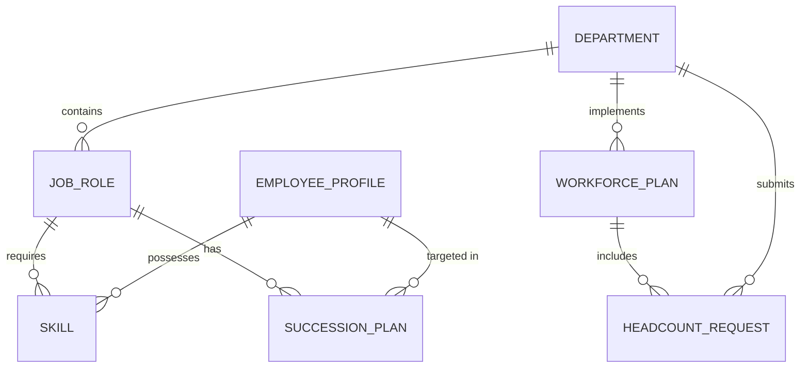

# Conceptual ERD — Workforce Planning System

## Mermaid Code

## Entity Description Table | Bang mo ta Entity

| # | Entity Name | Vietnamese Name | Description | Key Attributes | Main Relationships |
|---|-------------|-----------------|-------------|----------------|-------------------|
| 1 | DEPARTMENT | Phong ban | Thong tin cac phong ban trong to chuc | department_id, name | contains JOB_ROLE |
| 2 | JOB_ROLE | Vi tri cong viec | Cac vi tri can co trong mot phong ban | role_id, title, level | requires SKILL |
| 3 | SKILL | Ky nang | Cac nang luc/ky nang can thiet cho cong viec | skill_id, name, type | required by JOB_ROLE |
| 4 | WORKFORCE_PLAN | Ke hoach nhan su | Ban ke hoach nhan su tong the cho mot ky | plan_id, year, status | includes HEADCOUNT_REQUEST |
| 5 | HEADCOUNT_REQUEST | Yeu cau nhan su | Don yeu cau them nguoi cho mot vi tri | request_id, quantity | belongs to WORKFORCE_PLAN |
| 6 | SUCCESSION_PLAN | Ke hoach ke nhiem | Phuong an thay thê cho cac vi tri quan trong | succession_id, readiness | has JOB_ROLE |
| 7 | EMPLOYEE_PROFILE| Ho so nhan vien | Du lieu nang luc cua nhan vien hien tai | employee_id, current_role | possesses SKILL |
| 8 | TALENT_POOL | Kho nhan tai | Nhom cac nhan vien tiem nang | pool_id, category | contains EMPLOYEE_PROFILE |

## Relationship Description | Mo ta Quan he

| # | From Entity | Cardinality | To Entity | Relationship Label | Business Explanation |
|---|-------------|-------------|-----------|-------------------|----------------------|
| 1 | DEPARTMENT | one-to-many | JOB_ROLE | contains | Mot phong ban bao gom nhieu vi tri cong viec. |
| 2 | JOB_ROLE | one-to-many | SKILL | requires | Mot vi tri yeu cau nhieu ky nang khac nhau. |
| 3 | DEPARTMENT | one-to-many | WORKFORCE_PLAN | implements | Mot phong ban thuc thi nhieu ke hoach nhan su qua cac nam. |
| 4 | WORKFORCE_PLAN | one-to-many | HEADCOUNT_REQUEST | includes | Mot ke hoach nhan su bao gom nhieu yeu cau tang nguoi. |
| 5 | DEPARTMENT | one-to-many | HEADCOUNT_REQUEST | submits | Mot phong ban co the de xuat nhieu yeu cau nhan su. |
| 6 | JOB_ROLE | one-to-many | SUCCESSION_PLAN | has | Mot vi tri quan trong co the co nhieu ke hoach ke nhiem. |
| 7 | EMPLOYEE_PROFILE| one-to-many | SUCCESSION_PLAN | targeted in | Mot nhan vien co the duoc dua vao nhieu ke hoach ke nhiem. |
| 8 | EMPLOYEE_PROFILE| one-to-many | SKILL | possesses | Mot nhan vien co the so huu nhieu ky nang. |
