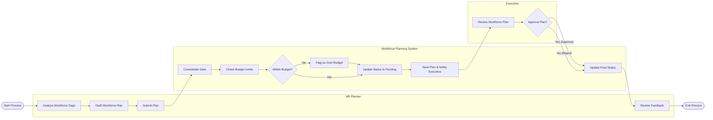

# Swimlane Diagram — Workforce Planning System

## Mermaid Code

## Flow Description | Mo ta luong

| Lane | Actor | Role in Flow |
|------|-------|-------------|
| 1 | HR Planner | Phan tich thuc trang, lap ke hoach nhan su va gui len de phe duyet. |
| 2 | Workforce Planning System | He thong kiem tra tinh toan ngan sach, danh dau trang thai va dieu phoi thong bao. |
| 3 | Executive | Ban Giam doc kiem tra ban ke hoach va ra quyet dinh phe duyet hoac tu choi. |
