# Action Tree — Workforce Planning System

## Mermaid Code

```mermaid
%%{init: {'theme': 'default'}}%%
graph TD
    Root["Workforce Planning System"]

    Root --> M1["Workforce Analytics"]
    Root --> M2["Demand Forecasting"]
    Root --> M3["Succession Planning"]
    Root --> M4["Gap Analysis"]
    Root --> M5["Headcount Management"]

    M1 --> A11["View Current Workforce"]
    M1 --> A12["Analyze Turnover Rates"]
    M1 --> A13["Track Diversity Metrics"]
    M1 --> A14["Export Analytics Report"]

    M2 --> A21["Set Growth Targets"]
    M2 --> A22["Generate Forecast"]
    M2 --> A23["Save Forecast Scenarios"]
    M2 --> A24["Compare Forecasts"]

    M3 --> A31["Identify Critical Roles"]
    M3 --> A32["Evaluate Candidates"]
    M3 --> A33["Create Succession Plan"]
    M3 --> A34["Monitor Readiness"]

    M4 --> A41["Assess Current Skills"]
    M4 --> A42["Identify Skill Deficits"]
    M4 --> A43["Recommend Training"]

    M5 --> A51["Submit Headcount Request"]
    M5 --> A52["Draft Workforce Plan"]
    M5 --> A53["Approve Workforce Plan"]
    M5 --> A54["Allocate Budgets"]
```

## Module Description | Mo ta Module

| # | Module | Description | Actions |
|---|--------|-------------|---------|
| 1 | Workforce Analytics | Phan tich du lieu nhan su hien tai cua to chuc | View Current Workforce, Analyze Turnover Rates, Track Diversity Metrics, Export Analytics Report |
| 2 | Demand Forecasting | Du bao nhu cau nhan su trong tuong lai | Set Growth Targets, Generate Forecast, Save Forecast Scenarios, Compare Forecasts |
| 3 | Succession Planning | Chuan bi doi ngu ke nhiem cho cac vi tri chu chot | Identify Critical Roles, Evaluate Candidates, Create Succession Plan, Monitor Readiness |
| 4 | Gap Analysis | Danh gia lo hong ky nang va nang luc | Assess Current Skills, Identify Skill Deficits, Recommend Training |
| 5 | Headcount Management | Quan ly so luong vi tri va phe duyet ke hoach | Submit Headcount Request, Draft Workforce Plan, Approve Workforce Plan, Allocate Budgets |
