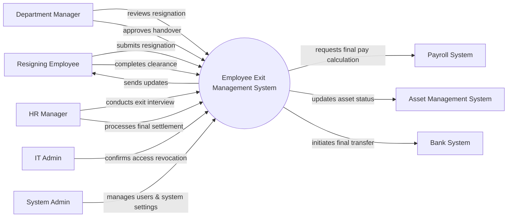

# Context Diagram — Employee Exit Management System

## Mermaid Code

## Actor & Interaction Table | Bang Actor & Tuong tac

| # | Actor | Actor Type | Data Sent TO System | Data Received FROM System | Notes |
|---|-------|------------|---------------------|---------------------------|-------|
| 1 | Resigning Employee | Primary | Resignation request, handover status | Exit procedure guidelines, approval updates | Nhan vien dang lam thu tuc nghi viec |
| 2 | Department Manager | Primary | Resignation approval, handover verification | Resignation alerts, handover checklists | Quan ly truc tiep cua nhan vien |
| 3 | HR Manager | Primary | Exit interview notes, settlement approval | Attrition reports, employee feedback | Nhan su phu trach thu tuc nghi viec |
| 4 | IT Admin | Primary | Access revocation confirmation | Revocation requests | Nhan vien IT thu hoi quyen truy cap |
| 5 | Payroll System | Supporting | Final salary calculation | Settlement request data | He thong tinh luong |
| 6 | Asset Management System | Supporting | Asset status confirmation | Asset return lists | He thong quan ly tai san |
| 7 | Bank System | Supporting | Transaction status | Final pay disbursement request | He thong ngan hang |
| 8 | System Admin | Primary | System configurations, user roles | System logs, audit reports | Quan tri he thong |

## System Boundary Description | Mo ta Pham vi He thong

The Employee Exit Management System centralizes and streamlines the offboarding process for resigning employees. It coordinates tasks across various departments, including HR for exit interviews, the Department Manager for task handovers, and IT for access revocation. The system integrates with external systems like the Payroll System, Asset Management System, and Bank System, but does not independently process financial transactions or directly manage physical assets. It acts as the orchestration engine to ensure all exit compliance requirements are met.
