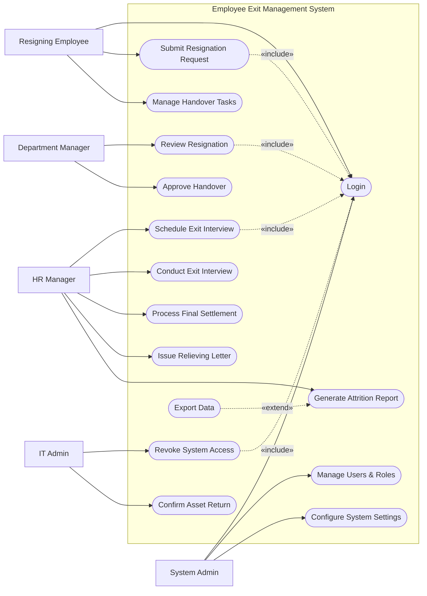

# Use Case Diagram — Employee Exit Management System

## Mermaid Code

## Actor Table | Bang Actor

| # | Actor | Actor Type | Role Description | Related Use Cases |
|---|-------|------------|------------------|-------------------|
| 1 | Resigning Employee | Primary | Nhan vien thuc hien thu tuc nghi viec | UC01, UC02, UC06 |
| 2 | Department Manager | Primary | Quan ly cua nhan vien, duyet don va cong viec ban giao | UC03, UC07 |
| 3 | HR Manager | Primary | Nhan su xu ly thu tuc, phong van va luong cuoi cung | UC04, UC05, UC10, UC11, UC12, UC15 |
| 4 | IT Admin | Primary | Nguoi thu hoi tai khoan va tai san IT | UC08, UC09 |
| 5 | System Admin | Primary | Quan tri vien he thong | UC01, UC13, UC14 |

## Use Case Table | Bang Use Case

| # | UC ID | Use Case Name | Primary Actor | Secondary Actor | Description | Priority |
|---|-------|---------------|---------------|-----------------|-------------|----------|
| 1 | UC01 | Login | Resigning Employee | | Authenticate user access | High |
| 2 | UC02 | Submit Resignation Request | Resigning Employee | | Initiate the exit process | High |
| 3 | UC03 | Review Resignation | Department Manager | | Review and approve/reject resignation | High |
| 4 | UC04 | Schedule Exit Interview | HR Manager | | Set a date for the exit interview | Medium |
| 5 | UC05 | Conduct Exit Interview | HR Manager | Resigning Employee | Record feedback from the employee | High |
| 6 | UC06 | Manage Handover Tasks | Resigning Employee | | Document pending and completed tasks | High |
| 7 | UC07 | Approve Handover | Department Manager | | Verify handover is completed | High |
| 8 | UC08 | Revoke System Access | IT Admin | | Disable all system accounts | High |
| 9 | UC09 | Confirm Asset Return | IT Admin | Asset Management System | Verify hardware is returned | High |
| 10 | UC10 | Process Final Settlement | HR Manager | Payroll System | Calculate final pay and dues | High |
| 11 | UC11 | Issue Relieving Letter | HR Manager | | Generate and send final documents | High |
| 12 | UC12 | Generate Attrition Report | HR Manager | | View stats on employee turnover | Medium |
| 13 | UC13 | Manage Users & Roles | System Admin | | Configure system users | High |
| 14 | UC14 | Configure System Settings | System Admin | | Manage workflows and configurations | Medium |
| 15 | UC15 | Export Data | HR Manager | | Download reports | Low |

## Use Case Specification | Dac ta Use Case

---

### UC01 — Login

| Field | Detail |
|-------|--------|
| **UC ID** | UC01 |
| **Use Case Name** | Login |
| **Actor(s)** | Primary: Resigning Employee, Department Manager, HR Manager, IT Admin, System Admin |
| **Description** | Cho phep nguoi dung xac thuc de dang nhap vao he thong. |
| **Precondition** | 1. Nguoi dung phai co tai khoan hop le.  2. He thong dang hoat dong binh thuong. |
| **Main Flow** | 1. Actor mo trang dang nhap.  2. System hien thi form dang nhap.  3. Actor nhap username va password.  4. Actor nhan Submit.  5. System xac thuc thong tin.  6. System chuyen huong den Dashboard. |
| **Alternative Flow** | **AF1** — Quen mat khau: Actor chon "Forgot Password", System cho phep dat lai mat khau qua email. |
| **Exception Flow** | **EX1** — Sai thong tin: System hien thi thong bao loi va yeu cau nhap lai.  **EX2** — Tai khoan bi khoa: Neu nhap sai qua 5 lan, System khoa tai khoan. |
| **Postcondition** | Nguoi dung dang nhap thanh cong. |
| **Business Rule** | **BR1**: Mat khau phai duoc ma hoa.  **BR2**: Phien lam viec het han sau 30 phut khong hoat dong. |

---

### UC02 — Submit Resignation Request

| Field | Detail |
|-------|--------|
| **UC ID** | UC02 |
| **Use Case Name** | Submit Resignation Request |
| **Actor(s)** | Primary: Resigning Employee |
| **Description** | Cho phep nhan vien tao va gui yeu cau xin nghi viec chinh thuc. |
| **Precondition** | 1. Nhan vien da dang nhap (Include UC01).  2. Nhan vien chua co don xin nghi viec nao dang pending. |
| **Main Flow** | 1. Actor chon "Submit Resignation".  2. System hien thi form dien thong tin.  3. Actor nhap ngay lam viec cuoi cung mong muon va ly do.  4. Actor nhan Submit.  5. System kiem tra thoi gian bao truoc (Notice Period).  6. System luu don va gui thong bao cho Department Manager. |
| **Alternative Flow** | **AF1** — Huy bo: Truoc khi Submit, Actor chon Cancel de thoat. |
| **Exception Flow** | **EX1** — Thieu thong tin: Neu bo trong ly do hoac ngay, System chan Submit va canh bao.  **EX2** — Ngay khong hop le: Neu ngay du kien qua gan hoac o qua khu, System bao loi. |
| **Postcondition** | Don duoc tao voi trang thai "Pending Approval". |
| **Business Rule** | **BR1**: Ngay lam cuoi cung phai cach ngay nop don it nhat theo so ngay Notice Period trong hop dong.  **BR2**: Khong duoc sua don sau khi Manager da duyet. |

---

### UC03 — Review Resignation

| Field | Detail |
|-------|--------|
| **UC ID** | UC03 |
| **Use Case Name** | Review Resignation |
| **Actor(s)** | Primary: Department Manager |
| **Description** | Quan ly phong ban xem xet va phe duyet hoac tu choi don xin nghi viec. |
| **Precondition** | 1. Manager da dang nhap (Include UC01).  2. Co don xin nghi dang o trang thai Pending. |
| **Main Flow** | 1. Actor chon "Pending Resignations".  2. System hien thi danh sach don.  3. Actor xem chi tiet mot don.  4. Actor nhan "Approve".  5. System cap nhat trang thai, khoi tao luong ban giao, va thong bao den HR. |
| **Alternative Flow** | **AF1** — Tu choi: O buoc 4, Actor nhan "Reject" va nhap ly do. System dong don va thong bao cho nhan vien. |
| **Exception Flow** | **EX1** — Don da xu ly: Neu don da bi huy boi nhan vien, System thong bao "Request cancelled". |
| **Postcondition** | Don chuyen sang "Approved" hoac "Rejected". Luong offboarding duoc kich hoat neu Approve. |
| **Business Rule** | **BR1**: Manager phai xac nhan lai ngay lam viec cuoi cung chinh thuc.  **BR2**: Chi xem duoc don cua nhan vien thuoc bo phan minh quan ly. |

---

### UC06 — Manage Handover Tasks

| Field | Detail |
|-------|--------|
| **UC ID** | UC06 |
| **Use Case Name** | Manage Handover Tasks |
| **Actor(s)** | Primary: Resigning Employee |
| **Description** | Nhan vien cap nhat tien do ban giao cac cong viec dang do dang. |
| **Precondition** | 1. Don xin nghi da duoc duyet (Approved).  2. Actor da dang nhap (Include UC01). |
| **Main Flow** | 1. Actor mo man hinh "Handover Checklist".  2. System hien thi danh sach cac task can ban giao.  3. Actor the task, mo ta, va nguoi nhan ban giao.  4. Actor danh dau tung task la "Completed" khi xong.  5. Actor nhan "Submit Handover".  6. System luu lai va thong bao Manager de kiem tra. |
| **Alternative Flow** | **AF1** — Luu nhap: Actor chon "Save Draft" de thoat ma khong nop. |
| **Exception Flow** | **EX1** — Chua hoan thanh: Neu van con task "Pending", System chan viec nop danh sach cuoi cung. |
| **Postcondition** | Danh sach ban giao chuyen trang thai thanh "Waiting for Approval". |
| **Business Rule** | **BR1**: Nguoi nhan ban giao phai la mot nhan vien khac dang hoat dong.  **BR2**: Khong the hoan tat offboarding neu Handover chua duoc duyet. |

---

### UC10 — Process Final Settlement

| Field | Detail |
|-------|--------|
| **UC ID** | UC10 |
| **Use Case Name** | Process Final Settlement |
| **Actor(s)** | Primary: HR Manager |
| **Description** | Tinh toan va xac nhan so tien luong cuoi cung kem cac khoan khau tru cho nhan vien nghi viec. |
| **Precondition** | 1. HR Manager da dang nhap (Include UC01).  2. Tat ca ban giao, thu hoi tai san da hoan tat. |
| **Main Flow** | 1. Actor mo man hinh "Final Settlement".  2. System tong hop so lieu (ngay cong cuoi, phep ton, no...).  3. Actor kiem tra va dieu chinh (neu co).  4. Actor nhan "Approve Settlement".  5. System chuyen du lieu toi Payroll System de chi tra.  6. System luu tru ho so luong cuoi cung. |
| **Alternative Flow** | **AF1** — Reject Settlement: Actor tra ho so ve buoc truoc do de kiem tra lai neu sai xot. |
| **Exception Flow** | **EX1** — Thieu du lieu: Neu IT hoac Manager chua xac nhan hoan tat, System chan viec Approved Settlement. |
| **Postcondition** | Trang thai Settlement la "Processed", cho chi tra luong. |
| **Business Rule** | **BR1**: Viec tinh luong chi thuc hien khi cac buoc Clearance (tai san, cong viec) da xong.  **BR2**: HR phai giu ban luu chi tiet khau tru (thue, bao hiem) de phat hanh the thanh toan cuoi cung. |
