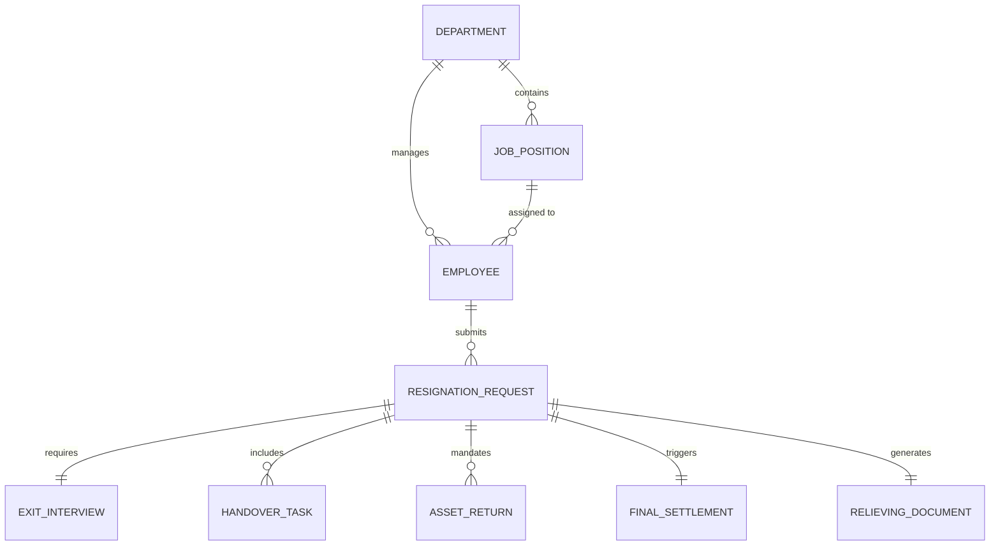

# Conceptual ERD — Employee Exit Management System

## Mermaid Code

## Entity Description Table | Bang mo ta Entity

| # | Entity Name | Vietnamese Name | Description | Key Attributes | Main Relationships |
|---|-------------|-----------------|-------------|----------------|-------------------|
| 1 | DEPARTMENT | Phong ban | Thong tin cac phong ban trong cong ty | department_id, name | contains JOB_POSITION |
| 2 | JOB_POSITION | Vi tri cong viec | Thong tin chuc danh cua nhan vien | job_id, title, level | assigned to EMPLOYEE |
| 3 | EMPLOYEE | Nhan vien | Ho so ca nhan cua nhan vien | employee_id, name, email | belongs to DEPARTMENT |
| 4 | RESIGNATION_REQUEST | Don xin nghi viec | Yeu cau nghi viec do nhan vien nop | request_id, notice_period, status | submits by EMPLOYEE |
| 5 | EXIT_INTERVIEW | Phong van nghi viec | Ghi chu phong van voi nhan su | interview_id, feedback, date | requires RESIGNATION_REQUEST |
| 6 | HANDOVER_TASK | Cong viec ban giao | Cac nhiem vu can chuyen giao | task_id, description, status | includes in RESIGNATION_REQUEST |
| 7 | ASSET_RETURN | Tra tai san | Danh sach tai san thiet bi can tra lai | asset_id, item_type, condition | mandates for RESIGNATION_REQUEST |
| 8 | FINAL_SETTLEMENT | Quyet toan cuoi cung | Tong hop luong va khau tru cuoi | settlement_id, final_amount | triggers from RESIGNATION_REQUEST |
| 9 | RELIEVING_DOCUMENT | Giay xac nhan | Giay to cham dut hop dong va chung nhan | doc_id, issue_date | generates from RESIGNATION_REQUEST |

## Relationship Description | Mo ta Quan he

| # | From Entity | Cardinality | To Entity | Relationship Label | Business Explanation |
|---|-------------|-------------|-----------|-------------------|----------------------|
| 1 | DEPARTMENT | one-to-many | JOB_POSITION | contains | Mot phong ban bao gom nhieu vi tri cong viec. |
| 2 | DEPARTMENT | one-to-many | EMPLOYEE | manages | Mot phong ban quan ly nhieu nhan vien. |
| 3 | JOB_POSITION | one-to-many | EMPLOYEE | assigned to | Mot vi tri co the duoc gan cho nhieu nhan vien. |
| 4 | EMPLOYEE | one-to-many | RESIGNATION_REQUEST | submits | Mot nhan vien co the nop nhieu don xin nghi (neu tung quay lai lam viec). |
| 5 | RESIGNATION_REQUEST | one-to-one | EXIT_INTERVIEW | requires | Moi don xin nghi viec can mot lan phong van exit. |
| 6 | RESIGNATION_REQUEST | one-to-many | HANDOVER_TASK | includes | Moi lan offboard can ban giao nhieu dau viec. |
| 7 | RESIGNATION_REQUEST | one-to-many | ASSET_RETURN | mandates | Moi lan offboard yeu cau tra nhieu tai san IT/cong ty. |
| 8 | RESIGNATION_REQUEST | one-to-one | FINAL_SETTLEMENT | triggers | Moi lan xin nghi viec tuong ung voi mot lan quyet toan cuoi. |
| 9 | RESIGNATION_REQUEST | one-to-one | RELIEVING_DOCUMENT | generates | Moi lan xin nghi se tao ra mot ho so/giay to xac nhan chinh thuc. |
