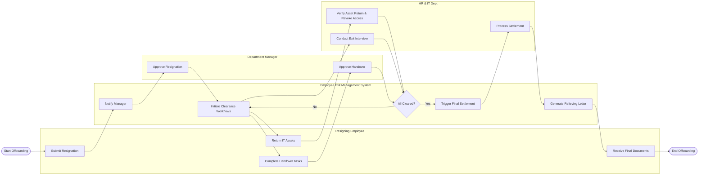

# Swimlane Diagram — Employee Exit Management System

## Mermaid Code

## Flow Description | Mo ta luong

| Lane | Actor | Role in Flow |
|------|-------|-------------|
| 1 | Resigning Employee | Nguoi khoi tao don, hoan thanh ban giao cong viec va tai san de duoc nghi viec. |
| 2 | Employee Exit Management System | He thong dieu pho luong cong viec, kiem tra tien do cua cac ben, va sinh tai lieu tu dong. |
| 3 | Department Manager | Quan ly truc tiep phe duyet don va xac nhan hoan tat ban giao cong viec. |
| 4 | HR & IT Dept | Bo phan thuc hien kiem tra tai san, thu hoi quyen, phong van nhan su va xu ly che do luong cuoi. |
