# Action Tree — Employee Exit Management System

## Mermaid Code

```mermaid
%%{init: {'theme': 'default'}}%%
graph TD
    Root["Employee Exit Management System"]

    Root --> M1["Resignation Processing"]
    Root --> M2["Exit Interview"]
    Root --> M3["Clearance & Handover"]
    Root --> M4["Final Settlement"]
    Root --> M5["System Administration"]

    M1 --> A11["Submit Resignation Request"]
    M1 --> A12["Review & Approve Resignation"]
    M1 --> A13["Set Notice Period"]
    M1 --> A14["Track Offboarding Status"]

    M2 --> A21["Schedule Interview"]
    M2 --> A22["Conduct Online Survey"]
    M2 --> A23["Record HR Feedback"]
    M2 --> A24["Analyze Attrition Trends"]

    M3 --> A31["Create Handover Checklist"]
    M3 --> A32["Verify Task Completion"]
    M3 --> A33["Confirm Asset Returns"]
    M3 --> A34["Revoke System Access"]

    M4 --> A41["Calculate Final Pay"]
    M4 --> A42["Deduct Pending Dues"]
    M4 --> A43["Approve Settlement"]
    M4 --> A44["Issue Relieving Letter"]

    M5 --> A51["Manage User Roles"]
    M5 --> A52["Configure Workflow Rules"]
    M5 --> A53["Setup Email Templates"]
```

## Module Description | Mo ta Module

| # | Module | Description | Actions |
|---|--------|-------------|---------|
| 1 | Resignation Processing | Xu ly don xin nghi viec va xac nhan | Submit Resignation Request, Review & Approve Resignation, Set Notice Period, Track Offboarding Status |
| 2 | Exit Interview | Quan ly lich trinh phong van va khao sat ly do nghi | Schedule Interview, Conduct Online Survey, Record HR Feedback, Analyze Attrition Trends |
| 3 | Clearance & Handover | Quan ly ban giao cong viec va thu hoi tai san | Create Handover Checklist, Verify Task Completion, Confirm Asset Returns, Revoke System Access |
| 4 | Final Settlement | Giai quyet luong, thuong, va cac chung tu roi viec | Calculate Final Pay, Deduct Pending Dues, Approve Settlement, Issue Relieving Letter |
| 5 | System Administration | Quan tri thiet lap he thong | Manage User Roles, Configure Workflow Rules, Setup Email Templates |
