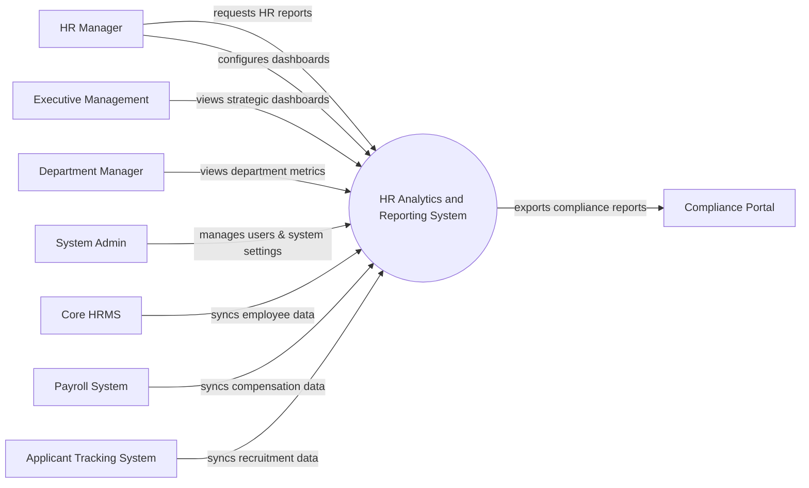

# Context Diagram — HR Analytics and Reporting System

## Mermaid Code

## Actor & Interaction Table | Bang Actor & Tuong tac

| # | Actor | Actor Type | Data Sent TO System | Data Received FROM System | Notes |
|---|-------|------------|---------------------|---------------------------|-------|
| 1 | HR Manager | Primary | Report requests, dashboard configurations | Detailed HR analytics, custom reports | Chuyen vien/Quan ly nhan su |
| 2 | Executive Management | Primary | Analytics queries, filter parameters | Strategic dashboards, high-level summaries | Ban giam doc |
| 3 | Department Manager | Primary | Filter parameters for team | Department-specific HR metrics | Quan ly bo phan |
| 4 | System Admin | Primary | System configurations, user roles | System logs, audit reports | Quan tri he thong |
| 5 | Core HRMS | Supporting | Core employee demographic data | Sync status logs | He thong nhan su loi |
| 6 | Payroll System | Supporting | Compensation and salary data | Sync status logs | He thong tinh luong |
| 7 | Applicant Tracking System | Supporting | Candidate and hiring metrics | Sync status logs | He thong tuyen dung |
| 8 | Compliance Portal | Regulatory | Compliance requirements | Exported compliance reports | Cong thong tin phap ly |

## System Boundary Description | Mo ta Pham vi He thong

The HR Analytics and Reporting System serves as a centralized intelligence platform for analyzing human resource data. It aggregates data from various supporting systems such as Core HRMS, Payroll, and ATS to generate actionable insights and dashboards. The system does not directly manage core HR operations or payroll processing; rather, it focuses exclusively on data visualization, metric tracking, and report generation. It also allows the System Admin to manage user access and system integrations.
