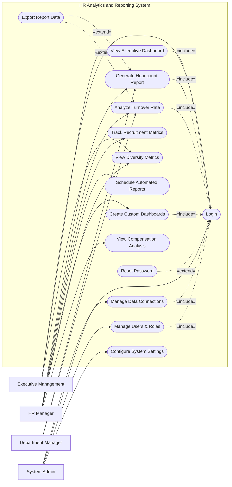

# Use Case Diagram — HR Analytics and Reporting System

## Mermaid Code

## Actor Table | Bang Actor

| # | Actor | Actor Type | Role Description | Related Use Cases |
|---|-------|------------|------------------|-------------------|
| 1 | Executive Management | Primary | Ban giam doc can xem bao cao tong quan chien luoc | UC01, UC02, UC13 |
| 2 | HR Manager | Primary | Nguoi phu trach phan tich so lieu va len bao cao nhan su | UC03, UC04, UC05, UC07, UC11, UC13, UC14 |
| 3 | Department Manager | Primary | Quan ly bo phan can xem thong ke nhan su trong team | UC03, UC04 |
| 4 | System Admin | Primary | Quan tri vien he thong, phan quyen va ket noi du lieu | UC01, UC08, UC09, UC10 |

## Use Case Table | Bang Use Case

| # | UC ID | Use Case Name | Primary Actor | Secondary Actor | Description | Priority |
|---|-------|---------------|---------------|-----------------|-------------|----------|
| 1 | UC01 | Login | Executive Management | | Authenticate user access | High |
| 2 | UC02 | View Executive Dashboard | Executive Management | | View high-level strategic HR metrics | High |
| 3 | UC03 | Generate Headcount Report | HR Manager | | Generate detailed headcount statistics | High |
| 4 | UC04 | Analyze Turnover Rate | HR Manager | | Analyze employee retention and turnover | High |
| 5 | UC05 | Track Recruitment Metrics | HR Manager | | Review hiring times, costs, and quality | Medium |
| 6 | UC06 | Export Report Data | HR Manager | | Download report data as PDF or Excel | Medium |
| 7 | UC07 | Schedule Automated Reports | HR Manager | | Automate periodic report generation | Medium |
| 8 | UC08 | Manage Data Connections | System Admin | | Configure integration with external HR systems | High |
| 9 | UC09 | Manage Users & Roles | System Admin | | Create and assign roles to system users | High |
| 10| UC10 | Configure System Settings | System Admin | | Set up system-wide parameters and alerts | Medium |
| 11| UC11 | Create Custom Dashboards | HR Manager | | Build personalized analytics dashboards | Medium |
| 12| UC12 | Reset Password | HR Manager | | Recover account access | High |
| 13| UC13 | View Diversity Metrics | Executive Management | | Monitor diversity and inclusion data | Medium |
| 14| UC14 | View Compensation Analysis | HR Manager | | Analyze salary ranges and equity | Low |

## Use Case Specification | Dac ta Use Case

---

### UC01 — Login

| Field | Detail |
|-------|--------|
| **UC ID** | UC01 |
| **Use Case Name** | Login |
| **Actor(s)** | Primary: Executive Management, HR Manager, Department Manager, System Admin |
| **Description** | Cho phep nguoi dung xac thuc de dang nhap vao he thong phan tich bao cao. |
| **Precondition** | 1. Nguoi dung phai co tai khoan hop le.  2. He thong dang hoat dong. |
| **Main Flow** | 1. Actor mo trang dang nhap.  2. System hien thi form dang nhap.  3. Actor nhap username va password.  4. Actor nhan nut Submit.  5. System xac thuc thong tin.  6. System chuyen huong den Dashboard tuong ung quyen han. |
| **Alternative Flow** | **AF1** — Quen mat khau: Neu Actor chon "Forgot Password", System kich hoat UC12 Reset Password. |
| **Exception Flow** | **EX1** — Sai thong tin: Neu xac thuc that bai, System hien thi thong bao loi.  **EX2** — Tai khoan bi khoa: Neu nhap sai 5 lan, System khoa tai khoan va yeu cau lien he Admin. |
| **Postcondition** | Nguoi dung dang nhap thanh cong, phien lam viec duoc tao. |
| **Business Rule** | **BR1**: Mat khau ma hoa.  **BR2**: Tu dong dang xuat sau 30 phut khong hoat dong. |

---

### UC03 — Generate Headcount Report

| Field | Detail |
|-------|--------|
| **UC ID** | UC03 |
| **Use Case Name** | Generate Headcount Report |
| **Actor(s)** | Primary: HR Manager |
| **Description** | Cho phep HR Manager tao bao cao thong ke so luong nhan su theo cac tieu chi khac nhau. |
| **Precondition** | 1. HR Manager da dang nhap (Include UC01).  2. Du lieu nhan su da duoc dong bo thanh cong. |
| **Main Flow** | 1. Actor chon "Reports" va chon "Headcount Report".  2. System hien thi man hinh tao bao cao voi cac bo loc.  3. Actor chon tieu chi (phong ban, dia diem, thoi gian).  4. Actor nhan "Generate".  5. System truy van du lieu va tong hop.  6. System hien thi bieu do va bang so lieu tren man hinh. |
| **Alternative Flow** | **AF1** — Xuat file: O buoc 6, Actor co the mo rong (Extend) UC06 de tai file PDF/Excel. |
| **Exception Flow** | **EX1** — Khong co du lieu: Neu ket qua tim kiem rong, System hien thi thong bao "No data available for the selected criteria". |
| **Postcondition** | Bao cao duoc hien thi tren man hinh cho Actor. |
| **Business Rule** | **BR1**: Du lieu hien thi phai la du lieu moi nhat tinh den cuoi ngay hom truoc.  **BR2**: HR Manager co the xem toan bo du lieu cua tat ca phong ban. |

---

### UC07 — Schedule Automated Reports

| Field | Detail |
|-------|--------|
| **UC ID** | UC07 |
| **Use Case Name** | Schedule Automated Reports |
| **Actor(s)** | Primary: HR Manager |
| **Description** | Cho phep HR Manager thiet lap he thong tu dong gui bao cao dinh ky qua email. |
| **Precondition** | 1. HR Manager da dang nhap.  2. He thong email da duoc Admin cau hinh san. |
| **Main Flow** | 1. Actor mo mot bao cao da tao va chon "Schedule".  2. System hien thi form thiet lap lich trinh.  3. Actor chon tan suat (hang ngay, tuan, thang) va nhap danh sach email nhan.  4. Actor nhan "Save Schedule".  5. System kiem tra tinh hop le cua email va lich trinh.  6. System luu tac vu vao hang doi va thong bao thanh cong. |
| **Alternative Flow** | **AF1** — Huy len lich: Truoc buoc 4, Actor nhan "Cancel" de dong form ma khong luu. |
| **Exception Flow** | **EX1** — Email khong hop le: Neu danh sach email sai dinh dang, System thong bao loi va yeu cau nhap lai. |
| **Postcondition** | Tac vu gui bao cao duoc he thong ghi nhan de thuc thi tu dong theo thoi gian da hen. |
| **Business Rule** | **BR1**: Lich trinh chi duoc thiet lap tuong lai, khong chap nhan thoi gian trong qua khu.  **BR2**: File dinh kem tu dong xuat ra format PDF. |

---

### UC09 — Manage Users & Roles

| Field | Detail |
|-------|--------|
| **UC ID** | UC09 |
| **Use Case Name** | Manage Users & Roles |
| **Actor(s)** | Primary: System Admin |
| **Description** | Admin tao, sua, hoac xoa tai khoan va phan quyen truy cap cho nguoi dung. |
| **Precondition** | 1. System Admin da dang nhap (Include UC01). |
| **Main Flow** | 1. Actor truy cap module "User Management".  2. System hien thi danh sach nguoi dung hien tai.  3. Actor chon "Add New User".  4. System hien thi form thong tin.  5. Actor nhap email, ten va chon Role (HR, Exec, Manager).  6. Actor nhan "Save".  7. System luu tai khoan va gui email kich hoat. |
| **Alternative Flow** | **AF1** — Chinh sua User: O buoc 3, Actor chon "Edit" cho mot user ton tai va cap nhat Role. |
| **Exception Flow** | **EX1** — Trung email: Neu email da ton tai, System thong bao "Email already registered" va chan thao tac luu. |
| **Postcondition** | Tai khoan nguoi dung moi duoc tao hoac duoc cap nhat quyen han. |
| **Business Rule** | **BR1**: Nguoi dung chi duoc xem cac dashboard va bao cao tuong ung voi Role cua minh. |

---

### UC11 — Create Custom Dashboards

| Field | Detail |
|-------|--------|
| **UC ID** | UC11 |
| **Use Case Name** | Create Custom Dashboards |
| **Actor(s)** | Primary: HR Manager |
| **Description** | Cho phep HR Manager tu tao bang dieu khien ca nhan hoa bang cach ghep cac widget. |
| **Precondition** | 1. HR Manager da dang nhap. |
| **Main Flow** | 1. Actor chon "Create Dashboard".  2. System hien thi giao dien keo-tha va danh sach cac Widget co san.  3. Actor keo tha cac Widget vao layout.  4. Actor nhap ten cho Dashboard moi.  5. Actor nhan "Save".  6. System luu cau hinh Dashboard vao tai khoan cua Actor. |
| **Alternative Flow** | **AF1** — Xoa Widget: Trong qua trinh keo tha, Actor co the xoa bo mot Widget khoi layout. |
| **Exception Flow** | **EX1** — Loi luu: Neu mang ngat khi dang luu, System thong bao "Network error, please try again". |
| **Postcondition** | Dashboard moi duoc luu va hien thi trong danh sach My Dashboards cua Actor. |
| **Business Rule** | **BR1**: Mot Dashboard chua toi da 10 Widgets de dam bao hieu suat.  **BR2**: Dashboard tuy chinh chi hien thi voi nguoi tao tru khi duoc chia se. |
