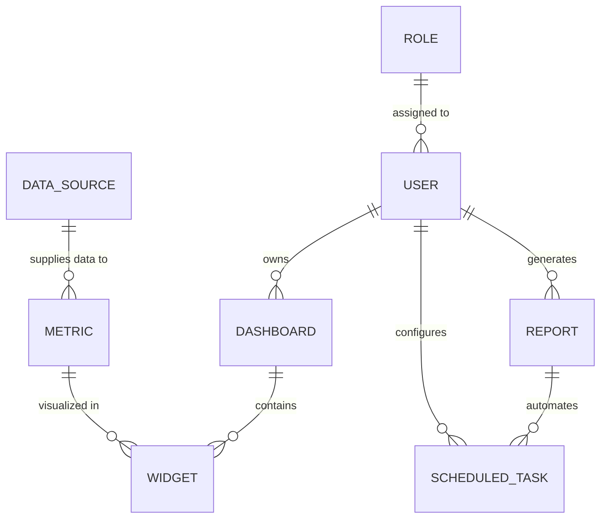

# Conceptual ERD — HR Analytics and Reporting System

## Mermaid Code

## Entity Description Table | Bang mo ta Entity

| # | Entity Name | Vietnamese Name | Description | Key Attributes | Main Relationships |
|---|-------------|-----------------|-------------|----------------|-------------------|
| 1 | ROLE | Vai tro | Quyen han truy cap trong he thong | role_id, role_name | assigned to USER |
| 2 | USER | Nguoi dung | Tai khoan truy cap he thong | user_id, username, email | owns DASHBOARD, generates REPORT |
| 3 | DASHBOARD | Bang dieu khien | Giao dien tong hop cac chi so | dashboard_id, title | contains WIDGET, belongs to USER |
| 4 | WIDGET | Tien ich | Cung cu bieu do thanh phan | widget_id, type, size | visualizes METRIC |
| 5 | METRIC | Chi so | Chi so nhan su cu thu (VD: Turnover) | metric_id, name, formula | supplied by DATA_SOURCE |
| 6 | REPORT | Bao cao | Bao cao thong ke hoan chinh | report_id, title, filter_data | automates SCHEDULED_TASK |
| 7 | SCHEDULED_TASK | Tac vu len lich | Lich gui bao cao tu dong | task_id, frequency, emails | belongs to REPORT |
| 8 | DATA_SOURCE | Nguon du lieu | Ket noi den he thong ben ngoai | source_id, connection_type | supplies METRIC |

## Relationship Description | Mo ta Quan he

| # | From Entity | Cardinality | To Entity | Relationship Label | Business Explanation |
|---|-------------|-------------|-----------|-------------------|----------------------|
| 1 | ROLE | one-to-many | USER | assigned to | Mot vai tro co the duoc phan bo cho nhieu nguoi dung. |
| 2 | USER | one-to-many | DASHBOARD | owns | Mot nguoi dung co the so huu nhieu bang dieu khien. |
| 3 | DASHBOARD | one-to-many | WIDGET | contains | Mot bang dieu khien chua nhieu tien ich hien thi. |
| 4 | METRIC | one-to-many | WIDGET | visualized in | Mot chi so co the duoc the hien tren nhieu tien ich khac nhau. |
| 5 | USER | one-to-many | REPORT | generates | Mot nguoi dung co the tao ra nhieu bao cao. |
| 6 | REPORT | one-to-many | SCHEDULED_TASK | automates | Mot bao cao co the co nhieu lich trinh gui tu dong. |
| 7 | DATA_SOURCE | one-to-many | METRIC | supplies data to | Mot nguon du lieu cung cap so lieu cho nhieu chi so. |
| 8 | USER | one-to-many | SCHEDULED_TASK | configures | Mot nguoi dung co the cau hinh nhieu tac vu tu dong. |
