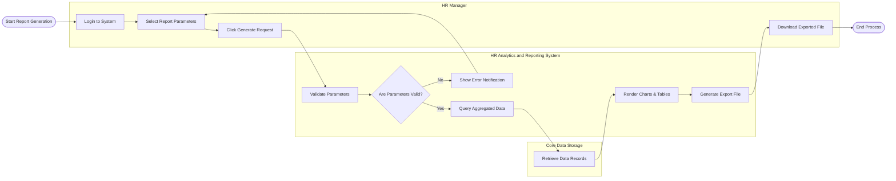

# Swimlane Diagram — HR Analytics and Reporting System

## Mermaid Code

## Flow Description | Mo ta luong

| Lane | Actor | Role in Flow |
|------|-------|-------------|
| 1 | HR Manager | Nguoi dung chon tieu chi va thuc hien yeu cau tao bao cao, sau do nhan ket qua de phan tich. |
| 2 | HR Analytics and Reporting System | He thong kiem tra tinh hop le, xu ly logic, tong hop thanh bieu do va xuat ra file tai ve. |
| 3 | Core Data Storage | Kho du lieu luu tru cac thong tin nhan su da dong bo tu cac he thong ben ngoai. |
