# Action Tree — HR Analytics and Reporting System

## Mermaid Code

```mermaid
%%{init: {'theme': 'default'}}%%
graph TD
    Root["HR Analytics and Reporting System"]

    Root --> M1["Dashboard Management"]
    Root --> M2["Report Generation"]
    Root --> M3["Metric Analysis"]
    Root --> M4["Data Integration"]
    Root --> M5["System Administration"]

    M1 --> A11["View Standard Dashboards"]
    M1 --> A12["Create Custom Dashboard"]
    M1 --> A13["Manage Widgets"]
    M1 --> A14["Share Dashboards"]

    M2 --> A21["Generate Ad-Hoc Reports"]
    M2 --> A22["Export Report Data"]
    M2 --> A23["Schedule Email Delivery"]
    M2 --> A24["Manage Report Templates"]

    M3 --> A31["Analyze Turnover & Retention"]
    M3 --> A32["Analyze Recruitment Pipeline"]
    M3 --> A33["Track Headcount Trends"]
    M3 --> A34["Analyze Diversity Metrics"]

    M4 --> A41["Configure Data Sources"]
    M4 --> A42["Monitor Sync Status"]
    M4 --> A43["Trigger Manual Sync"]

    M5 --> A51["Manage User Accounts"]
    M5 --> A52["Configure Role Permissions"]
    M5 --> A53["Manage System Settings"]
    M5 --> A54["View Audit Logs"]
```

## Module Description | Mo ta Module

| # | Module | Description | Actions |
|---|--------|-------------|---------|
| 1 | Dashboard Management | Quan ly va hien thi cac bang dieu khien tuong tac | View Standard Dashboards, Create Custom Dashboard, Manage Widgets, Share Dashboards |
| 2 | Report Generation | Tao, xuat va len lich tu dong cho cac bao cao | Generate Ad-Hoc Reports, Export Report Data, Schedule Email Delivery, Manage Report Templates |
| 3 | Metric Analysis | Phan tich chuyen sau cho tung nhom chi so nhan su | Analyze Turnover & Retention, Analyze Recruitment Pipeline, Track Headcount Trends, Analyze Diversity Metrics |
| 4 | Data Integration | Quan ly ket noi va dong bo voi cac he thong ben ngoai | Configure Data Sources, Monitor Sync Status, Trigger Manual Sync |
| 5 | System Administration | Quan tri tai khoan, phan quyen va thiet lap he thong | Manage User Accounts, Configure Role Permissions, Manage System Settings, View Audit Logs |
