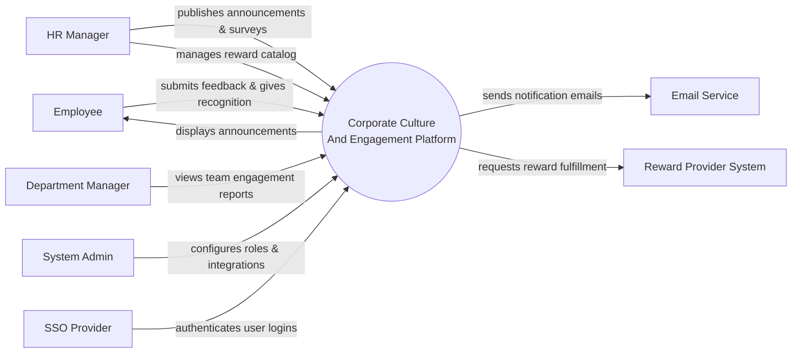

# Context Diagram — Corporate Culture And Engagement Platform

## Mermaid Code

## Actor & Interaction Table | Bang Actor & Tuong tac

| # | Actor | Actor Type | Data Sent TO System | Data Received FROM System | Notes |
|---|-------|------------|---------------------|---------------------------|-------|
| 1 | Employee | Primary | Survey responses, peer recognitions, reward redemption requests | Announcements, notifications, reward points | Nhan vien trong cong ty |
| 2 | HR Manager | Primary | Announcements, survey configurations, reward catalogs | Engagement analytics, survey results | Quan ly nhan su |
| 3 | Department Manager | Primary | Approval for high-value recognitions | Team engagement metrics | Quan ly bo phan |
| 4 | System Admin | Primary | System configurations, user roles, integrations | System logs, audit reports | Quan tri he thong |
| 5 | Email Service | Supporting | Delivery statuses | Notification content, recipient emails | Dich vu gui email |
| 6 | Reward Provider System | Supporting | Reward fulfillment statuses | Reward orders, delivery details | He thong doi thuong |
| 7 | SSO Provider | Supporting | Authentication tokens, user identities | Login requests | He thong xac thuc |

## System Boundary Description | Mo ta Pham vi He thong

The Corporate Culture And Engagement Platform manages internal communications, employee feedback, and peer recognition programs. It serves as a central hub for HR Managers to build company culture and for employees to engage with their peers and company initiatives. The system does not directly fulfill physical rewards or handle base payroll; instead, it tracks engagement points and integrates with a Reward Provider System. It also relies on an SSO Provider for authentication and an Email Service for broad notifications.
