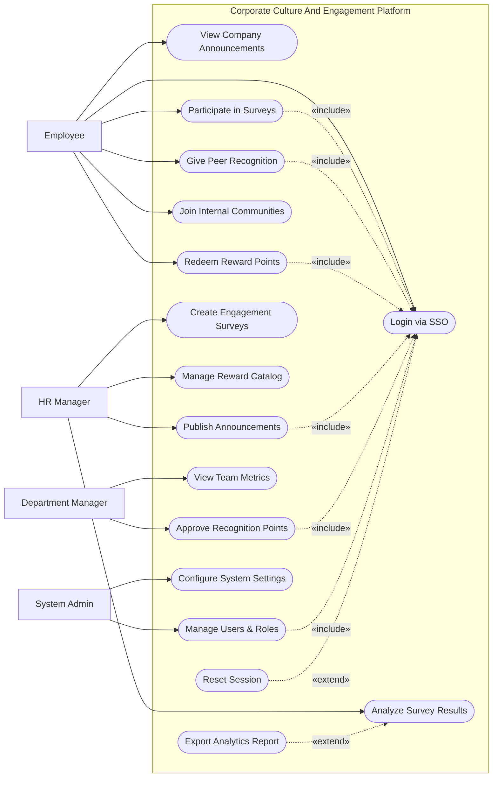

# Use Case Diagram — Corporate Culture And Engagement Platform

## Mermaid Code

## Actor Table | Bang Actor

| # | Actor | Actor Type | Role Description | Related Use Cases |
|---|-------|------------|------------------|-------------------|
| 1 | Employee | Primary | Nhan vien thong thuong trong cong ty tham gia cac hoat dong | UC01, UC02, UC03, UC04, UC05, UC06 |
| 2 | Department Manager | Primary | Nguoi quan ly nhom, duyet thuong va xem bao cao team | UC11, UC12 |
| 3 | HR Manager | Primary | Nguoi quan tri van hoa, tao khao sat va thong bao | UC07, UC08, UC09, UC10 |
| 4 | System Admin | Primary | Quan tri vien he thong, phan quyen va cai dat | UC13, UC14 |

## Use Case Table | Bang Use Case

| # | UC ID | Use Case Name | Primary Actor | Secondary Actor | Description | Priority |
|---|-------|---------------|---------------|-----------------|-------------|----------|
| 1 | UC01 | Login via SSO | Employee | SSO Provider | Authenticate user access | High |
| 2 | UC02 | View Company Announcements | Employee | | Read internal news | Medium |
| 3 | UC03 | Participate in Surveys | Employee | | Submit feedback forms | High |
| 4 | UC04 | Give Peer Recognition | Employee | | Award points to colleagues | High |
| 5 | UC05 | Redeem Reward Points | Employee | Reward System | Exchange points for items | Medium |
| 6 | UC06 | Join Internal Communities | Employee | | Participate in groups | Low |
| 7 | UC07 | Publish Announcements | HR Manager | | Post news to the platform | High |
| 8 | UC08 | Create Engagement Surveys | HR Manager | | Design and launch surveys | High |
| 9 | UC09 | Analyze Survey Results | HR Manager | | View survey dashboards | High |
| 10| UC10 | Manage Reward Catalog | HR Manager | | Update available rewards | Medium |
| 11| UC11 | Approve Recognition Points | Department Manager| | Approve large point transfers | High |
| 12| UC12 | View Team Metrics | Department Manager| | Check team engagement | Medium |
| 13| UC13 | Manage Users & Roles | System Admin | | Manage system access | High |
| 14| UC14 | Configure System Settings | System Admin | | Update global parameters | Medium |
| 15| UC15 | Export Analytics Report | HR Manager | | Download data as PDF/Excel | Low |
| 16| UC16 | Reset Session | Employee | | Restart expired session | Low |

## Use Case Specification | Dac ta Use Case

---

### UC01 — Login via SSO

| Field | Detail |
|-------|--------|
| **UC ID** | UC01 |
| **Use Case Name** | Login via SSO |
| **Actor(s)** | Primary: Employee, HR Manager, Department Manager, System Admin / Secondary: SSO Provider |
| **Description** | Cho phep nguoi dung dang nhap vao he thong thong qua cong xac thuc chung (SSO). |
| **Precondition** | 1. Nguoi dung co tai khoan cong ty hop le.  2. SSO Provider dang hoat dong. |
| **Main Flow** | 1. Actor mo he thong.  2. System chuyen huong sang trang SSO.  3. Actor nhap thong tin dang nhap tai SSO.  4. SSO xac thuc va tra ve token cho System.  5. System phan tich token, xac dinh quyen han.  6. System hien thi trang chu tuong ung. |
| **Alternative Flow** | **AF1** — Phien dang nhap het han: Actor dung UC16 de khoi tao lai phien ma khong can nhap lai mat khau neu SSO con hieu luc. |
| **Exception Flow** | **EX1** — SSO that bai: Neu SSO tra ve loi, System hien thi thong bao khong the truy cap va yeu cau lien he Admin.  **EX2** — Tai khoan bi vo hieu: Neu tai khoan bi khoa trong System, chan truy cap. |
| **Postcondition** | Nguoi dung duoc dang nhap hop le vao he thong. |
| **Business Rule** | **BR1**: Phai xac thuc qua SSO, khong dung mat khau noi bo.  **BR2**: Phien tu dong thoat sau 60 phut khong hoat dong. |

---

### UC04 — Give Peer Recognition

| Field | Detail |
|-------|--------|
| **UC ID** | UC04 |
| **Use Case Name** | Give Peer Recognition |
| **Actor(s)** | Primary: Employee |
| **Description** | Nhan vien tang diem va viet loi chuc/ghi nhan cho dong nghiep. |
| **Precondition** | 1. Actor da dang nhap (Include UC01).  2. Actor co du diem thuong trong quy ca nhan. |
| **Main Flow** | 1. Actor chon "Recognize Peer".  2. System hien thi form tim kiem dong nghiep.  3. Actor chon nguoi nhan, nhap so diem va loi chuc.  4. Actor nhan "Send".  5. System kiem tra quy diem cua nguoi gui.  6. System tru diem nguoi gui, cong diem nguoi nhan va gui thong bao. |
| **Alternative Flow** | **AF1** — Nhap qua so diem tran: Neu so diem vuot muc tu dong duyet, System chuyen sang trang thai cho (Pending) va kich hoat UC11. |
| **Exception Flow** | **EX1** — Khong du diem: System bao loi "Insufficient points" va yeu cau nhap lai.  **EX2** — Tu tang diem: System bao loi "Cannot recognize yourself". |
| **Postcondition** | Diem duoc chuyen va ban ghi nhan duoc hien thi tren bang tin. |
| **Business Rule** | **BR1**: Moi nhan vien duoc cap mot luong diem co dinh hang thang de tang nguoi khac.  **BR2**: So diem tang duoi 50 duoc tu dong duyet. |

---

### UC05 — Redeem Reward Points

| Field | Detail |
|-------|--------|
| **UC ID** | UC05 |
| **Use Case Name** | Redeem Reward Points |
| **Actor(s)** | Primary: Employee / Secondary: Reward System |
| **Description** | Nhan vien dung diem tich luy de doi qua tang hoac voucher. |
| **Precondition** | 1. Actor da dang nhap (Include UC01).  2. Actor co so diem lon hon 0. |
| **Main Flow** | 1. Actor vao "Reward Catalog".  2. System hien thi danh sach qua tang va diem cua Actor.  3. Actor chon mon qua va chon "Redeem".  4. System xac nhan thong tin va tru diem.  5. System gui yeu cau den Reward System.  6. System hien thi ma voucher hoac thong bao thanh cong. |
| **Alternative Flow** | **AF1** — Xem lich su: Actor chon "History" de xem cac mon qua da doi. |
| **Exception Flow** | **EX1** — Khong du diem: System bao loi khi Actor chon mon qua co gia tri cao hon diem dang co.  **EX2** — Qua het han/Het hang: System bao loi "Item out of stock" va khong tru diem. |
| **Postcondition** | Diem cua nguoi dung bi tru, yeu cau doi qua duoc ghi nhan. |
| **Business Rule** | **BR1**: Diem nhan duoc tu dong nghiep khong co thoi han su dung.  **BR2**: Ma voucher xuat ra khong the hoan tra. |

---

### UC08 — Create Engagement Surveys

| Field | Detail |
|-------|--------|
| **UC ID** | UC08 |
| **Use Case Name** | Create Engagement Surveys |
| **Actor(s)** | Primary: HR Manager |
| **Description** | HR Manager tao khao sat de thu thap y kien phan hoi tu nhan vien. |
| **Precondition** | 1. HR Manager da dang nhap. |
| **Main Flow** | 1. Actor chon "Create Survey".  2. System hien thi trinh tao form.  3. Actor nhap tieu de, mo ta va them cac cau hoi.  4. Actor thiet lap doi tuong nhan va thoi han.  5. Actor nhan "Publish".  6. System luu khao sat va gui thong bao den doi tuong. |
| **Alternative Flow** | **AF1** — Luu nhap: Tai buoc 5, Actor chon "Save as Draft" de luu tam ma chua phat hanh. |
| **Exception Flow** | **EX1** — Thieu thong tin bat buoc: System danh dau cac truong bi thieu va yeu cau bo sung.  **EX2** — Thoi han khong hop le: System bao loi neu thoi han ket thuc nho hon hien tai. |
| **Postcondition** | Khao sat duoc tao va phat hanh toi nhan vien. |
| **Business Rule** | **BR1**: Khao sat co the thiet lap che do an danh (Anonymous).  **BR2**: Khong the chinh sua cau hoi sau khi khao sat da bat dau co nguoi tra loi. |
