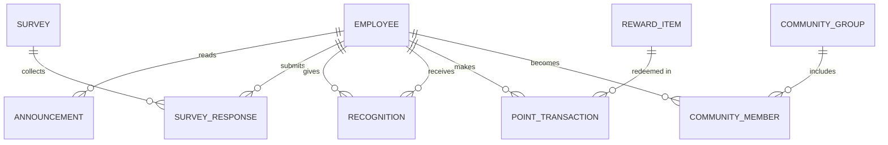

# Conceptual ERD — Corporate Culture And Engagement Platform

## Mermaid Code

## Entity Description Table | Bang mo ta Entity

| # | Entity Name | Vietnamese Name | Description | Key Attributes | Main Relationships |
|---|-------------|-----------------|-------------|----------------|-------------------|
| 1 | EMPLOYEE | Nhan vien | Nguoi dung trong he thong | employee_id, name, email, point_balance | gives/receives RECOGNITION |
| 2 | ANNOUNCEMENT | Thong bao | Tin tuc, thong bao tu HR | announcement_id, title, content | read by EMPLOYEE |
| 3 | SURVEY | Khao sat | Bai khao sat thu thap y kien | survey_id, title, deadline | collects SURVEY_RESPONSE |
| 4 | SURVEY_RESPONSE | Phieu tra loi | Cau tra loi khao sat cua nhan vien | response_id, answers, date | belongs to SURVEY |
| 5 | RECOGNITION | Bai ghi nhan | Loi khen ngai va diem tang | recognition_id, message, points | given/received by EMPLOYEE |
| 6 | REWARD_ITEM | Qua tang | Danh muc qua co the doi bang diem | reward_id, name, points_required | redeemed in POINT_TRANSACTION |
| 7 | POINT_TRANSACTION | Giao dich diem | Lich su cong/tru diem | transaction_id, type, amount | made by EMPLOYEE |
| 8 | COMMUNITY_GROUP | Nhom cong dong | Cac nhom so thich noi bo | group_id, name, description | includes COMMUNITY_MEMBER |
| 9 | COMMUNITY_MEMBER | Thanh vien nhom | Bang noi giua nhan vien va nhom | member_id, join_date | links EMPLOYEE & COMMUNITY_GROUP |

## Relationship Description | Mo mo Quan he

| # | From Entity | Cardinality | To Entity | Relationship Label | Business Explanation |
|---|-------------|-------------|-----------|-------------------|----------------------|
| 1 | EMPLOYEE | one-to-many | ANNOUNCEMENT | reads | Mot nhan vien co the doc nhieu thong bao. |
| 2 | EMPLOYEE | one-to-many | SURVEY_RESPONSE | submits | Mot nhan vien nop nhieu phieu tra loi cho cac khao sat. |
| 3 | SURVEY | one-to-many | SURVEY_RESPONSE | collects | Mot khao sat thu thap nhieu phieu tra loi. |
| 4 | EMPLOYEE | one-to-many | RECOGNITION | gives | Mot nhan vien tang nhieu bai ghi nhan cho nguoi khac. |
| 5 | EMPLOYEE | one-to-many | RECOGNITION | receives | Mot nhan vien nhan nhieu bai ghi nhan tu nguoi khac. |
| 6 | EMPLOYEE | one-to-many | POINT_TRANSACTION | makes | Mot nhan vien tao ra nhieu giao dich diem. |
| 7 | REWARD_ITEM | one-to-many | POINT_TRANSACTION | redeemed in | Mot mon qua co the duoc doi trong nhieu giao dich. |
| 8 | EMPLOYEE | one-to-many | COMMUNITY_MEMBER | becomes | Mot nhan vien tro thanh thanh vien cua nhieu nhom. |
| 9 | COMMUNITY_GROUP | one-to-many | COMMUNITY_MEMBER | includes | Mot nhom bao gom nhieu thanh vien. |
