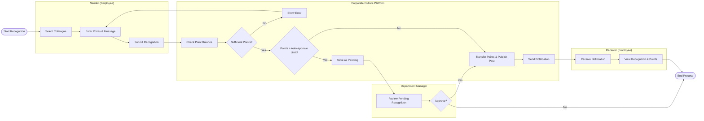

# Swimlane Diagram — Corporate Culture And Engagement Platform

## Mermaid Code

## Flow Description | Mo ta luong

| Lane | Actor | Role in Flow |
|------|-------|-------------|
| 1 | Sender (Employee) | Nguoi chu dong chon dong nghiep va tang diem ghi nhan. |
| 2 | Corporate Culture Platform | He thong kiem tra so diem, chuyen diem, xuat ban bai viet va gui thong bao. |
| 3 | Department Manager | Nguoi quan ly duyet cac khoan thuong diem lon vuot muc tu dong. |
| 4 | Receiver (Employee) | Nguoi nhan loi khen ngai, diem thuong va xem thong bao tu he thong. |
