# Action Tree — Corporate Culture And Engagement Platform

## Mermaid Code

```mermaid
%%{init: {'theme': 'default'}}%%
graph TD
    Root["Corporate Culture And Engagement Platform"]

    Root --> M1["Communications"]
    Root --> M2["Surveys & Feedback"]
    Root --> M3["Recognition & Rewards"]
    Root --> M4["Community"]
    Root --> M5["System Admin"]

    M1 --> A11["Publish Announcements"]
    M1 --> A12["View News Feed"]
    M1 --> A13["Manage News Categories"]

    M2 --> A21["Create Surveys"]
    M2 --> A22["Submit Responses"]
    M2 --> A23["Analyze Survey Data"]
    M2 --> A24["Export Survey Reports"]

    M3 --> A31["Give Peer Recognition"]
    M3 --> A32["Approve Large Recognitions"]
    M3 --> A33["Redeem Reward Points"]
    M3 --> A34["Manage Reward Catalog"]

    M4 --> A41["Create Internal Group"]
    M4 --> A42["Join Group"]
    M4 --> A43["Post to Group"]

    M5 --> A51["Manage User Access"]
    M5 --> A52["Configure Point Rules"]
    M5 --> A53["Integrate External Systems"]
    M5 --> A54["View System Audit Logs"]
```

## Module Description | Mo ta Module

| # | Module | Description | Actions |
|---|--------|-------------|---------|
| 1 | Communications | Quan ly tin tuc va thong bao noi bo | Publish Announcements, View News Feed, Manage News Categories |
| 2 | Surveys & Feedback | Thu thap y kien dong gop cua nhan vien | Create Surveys, Submit Responses, Analyze Survey Data, Export Survey Reports |
| 3 | Recognition & Rewards | He thong tang diem, khen thuong va doi qua | Give Peer Recognition, Approve Large Recognitions, Redeem Reward Points, Manage Reward Catalog |
| 4 | Community | Quan ly cac nhom so thich va giao luu | Create Internal Group, Join Group, Post to Group |
| 5 | System Admin | Cai dat he thong, phan quyen va tich hop | Manage User Access, Configure Point Rules, Integrate External Systems, View System Audit Logs |
