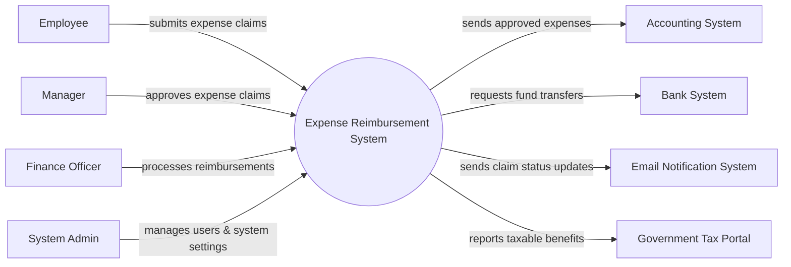

# Context Diagram — Expense Reimbursement System

## Mermaid Code

## Actor & Interaction Table | Bang Actor & Tuong tac

| # | Actor | Actor Type | Data Sent TO System | Data Received FROM System | Notes |
|---|-------|------------|---------------------|---------------------------|-------|
| 1 | Employee | Primary | Expense claims, receipts, bank details | Claim status updates, payment confirmations | Nhan vien tao don cong tac phi |
| 2 | Manager | Primary | Claim approvals, rejection reasons | Pending claim notifications | Quan ly duyet don |
| 3 | Finance Officer | Primary | Reimbursement processing, audit flags | Approved claims ready for payment | Nhan vien tai chinh |
| 4 | System Admin | Primary | System configurations, user roles | System logs, audit reports | Quan tri he thong |
| 5 | Accounting System | Supporting | Payment confirmation status | Approved expense records | He thong ke toan |
| 6 | Bank System | Supporting | Transaction statuses | Fund transfer requests | He thong ngan hang |
| 7 | Email Notification System | Supporting | Delivery statuses | Notification messages | He thong gui email |
| 8 | Government Tax Portal | Regulatory | Tax policy updates | Taxable benefits reports | Cong thue chinh phu |

## System Boundary Description | Mo ta Pham vi He thong

The Expense Reimbursement System is responsible for managing the end-to-end process of employee expense claims, from submission and managerial approval to financial auditing. It serves as the primary interface for employees to upload receipts and track their reimbursement status. The system does not directly process financial transactions or maintain general ledgers; instead, it integrates with external Accounting Systems and Bank Systems. It also handles role-based access control and system configurations managed by the System Admin.
