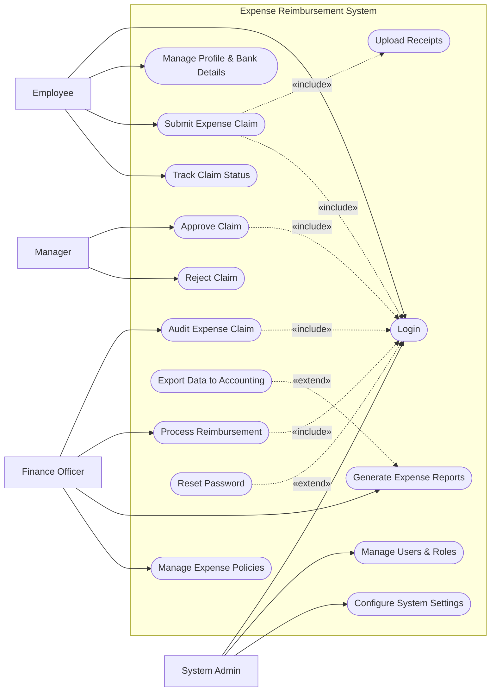

# Use Case Diagram — Expense Reimbursement System

## Mermaid Code

## Actor Table | Bang Actor

| # | Actor | Actor Type | Role Description | Related Use Cases |
|---|-------|------------|------------------|-------------------|
| 1 | Employee | Primary | Nhan vien tao don hoan tien | UC01, UC02, UC03, UC04, UC05, UC15 |
| 2 | Manager | Primary | Quan ly xet duyet don hoan tien | UC01, UC06, UC07 |
| 3 | Finance Officer | Primary | Nhan vien tai chinh kiem toan va thanh toan | UC01, UC08, UC09, UC10, UC11, UC12 |
| 4 | System Admin | Primary | Quan tri vien he thong | UC01, UC13, UC14 |

## Use Case Table | Bang Use Case

| # | UC ID | Use Case Name | Primary Actor | Secondary Actor | Description | Priority |
|---|-------|---------------|---------------|-----------------|-------------|----------|
| 1 | UC01 | Login | Employee | | Authenticate user access | High |
| 2 | UC02 | Manage Profile & Bank Details | Employee | | Update personal and bank info | Medium |
| 3 | UC03 | Submit Expense Claim | Employee | | Create a new claim | High |
| 4 | UC04 | Upload Receipts | Employee | | Attach proof of expenses | High |
| 5 | UC05 | Track Claim Status | Employee | | View the status of claims | Low |
| 6 | UC06 | Approve Claim | Manager | | Approve employee expenses | High |
| 7 | UC07 | Reject Claim | Manager | | Reject invalid claims | High |
| 8 | UC08 | Audit Expense Claim | Finance Officer | | Verify expenses against policy | High |
| 9 | UC09 | Process Reimbursement | Finance Officer | Bank System | Trigger actual payment | High |
| 10| UC10 | Generate Expense Reports | Finance Officer | | Create financial reports | Medium |
| 11| UC11 | Export Data to Accounting | Finance Officer | Accounting System | Sync data to accounting | Medium |
| 12| UC12 | Manage Expense Policies | Finance Officer | | Update rules and limits | Medium |
| 13| UC13 | Manage Users & Roles | System Admin | | Manage user access | High |
| 14| UC14 | Configure System Settings | System Admin | | Change system parameters | Medium |
| 15| UC15 | Reset Password | Employee | | Recover account | High |

## Use Case Specification | Dac ta Use Case

---

### UC01 — Login

| Field | Detail |
|-------|--------|
| **UC ID** | UC01 |
| **Use Case Name** | Login |
| **Actor(s)** | Primary: Employee, Manager, Finance Officer, System Admin |
| **Description** | Cho phep nguoi dung xac thuc de dang nhap vao he thong. |
| **Precondition** | 1. Nguoi dung phai co tai khoan hop le tren he thong.  2. He thong dang hoat dong binh thuong. |
| **Main Flow** | 1. Actor mo trang dang nhap.  2. System hien thi form dang nhap.  3. Actor nhap username va password.  4. Actor nhan nut Submit.  5. System xac thuc thong tin.  6. System chuyen huong den trang chu tuong ung quyen han. |
| **Alternative Flow** | **AF1** — Quen mat khau: Neu Actor chon "Forgot Password", System kich hoat UC15 Reset Password. |
| **Exception Flow** | **EX1** — Sai thong tin: Neu xac thuc that bai, System hien thi thong bao loi va yeu cau nhap lai.  **EX2** — Tai khoan bi khoa: Neu nhap sai qua 5 lan, System khoa tai khoan va thong bao lien he Admin. |
| **Postcondition** | Nguoi dung duoc dang nhap va phien lam viec duoc khoi tao. |
| **Business Rule** | **BR1**: Mat khau phai duoc ma hoa.  **BR2**: Phien dang nhap tu dong het han sau 30 phut khong hoat dong. |

---

### UC03 — Submit Expense Claim

| Field | Detail |
|-------|--------|
| **UC ID** | UC03 |
| **Use Case Name** | Submit Expense Claim |
| **Actor(s)** | Primary: Employee |
| **Description** | Cho phep nhan vien tao va gui yeu cau hoan tien chi phi. |
| **Precondition** | 1. Nhan vien da dang nhap.  2. Nhan vien da cap nhat thong tin tai khoan ngan hang hop le. |
| **Main Flow** | 1. Actor chon "Create Claim".  2. System hien thi form nhap thong tin chi phi.  3. Actor dien cac muc chi phi, so tien va ngay thang.  4. Actor tai len hoa don (Include UC04).  5. Actor nhan "Submit".  6. System kiem tra tinh hop le.  7. System luu don o trang thai "Pending Approval" va gui thong bao cho Manager. |
| **Alternative Flow** | **AF1** — Luu nhap: O buoc 5, Actor chon "Save as Draft", System luu don o trang thai "Draft". |
| **Exception Flow** | **EX1** — Thieu hoa don: Neu khong co hoa don dinh kem cho chi phi bat buoc, System bao loi.  **EX2** — Vuot han muc: Neu so tien vuot qua gioi han chinh sach, System canh bao hoac chan Submit tuy thuoc vao policy. |
| **Postcondition** | Don hoan tien duoc tao va chuyen den Manager de duyet. |
| **Business Rule** | **BR1**: Moi khoan chi phi phai co hoa don dinh kem neu tren muc quy dinh.  **BR2**: Tong so tien khong duoc am. |

---

### UC06 — Approve Claim

| Field | Detail |
|-------|--------|
| **UC ID** | UC06 |
| **Use Case Name** | Approve Claim |
| **Actor(s)** | Primary: Manager |
| **Description** | Quan ly xem xet va phe duyet don hoan tien cua nhan vien. |
| **Precondition** | 1. Manager da dang nhap.  2. Co it nhat 1 don o trang thai "Pending Approval". |
| **Main Flow** | 1. Actor vao danh sach don cho duyet.  2. System hien thi danh sach don "Pending Approval".  3. Actor chon xem chi tiet mot don.  4. Actor kiem tra thong tin va hoa don.  5. Actor nhan "Approve".  6. System cap nhat trang thai don thanh "Pending Audit" va gui thong bao cho Finance Officer va Employee. |
| **Alternative Flow** | **AF1** — Yeu cau bo sung: O buoc 5, Actor chon "Request Changes", System chuyen don ve "Draft" kem ghi chu. |
| **Exception Flow** | **EX1** — Don da xu ly: Neu don da bi huy, System hien thi loi va tai lai trang. |
| **Postcondition** | Trang thai don chuyen thanh "Pending Audit". |
| **Business Rule** | **BR1**: Manager chi co the duyet don cua nhan vien thuoc bo phan minh.  **BR2**: Manager khong the tu duyet don cua chinh minh. |

---

### UC08 — Audit Expense Claim

| Field | Detail |
|-------|--------|
| **UC ID** | UC08 |
| **Use Case Name** | Audit Expense Claim |
| **Actor(s)** | Primary: Finance Officer |
| **Description** | Nhan vien tai chinh kiem tra tinh hop le cua don sau khi Manager da duyet. |
| **Precondition** | 1. Finance Officer da dang nhap.  2. Co don o trang thai "Pending Audit". |
| **Main Flow** | 1. Actor vao man hinh "Auditing".  2. System hien thi danh sach don "Pending Audit".  3. Actor chon don de kiem tra lai hoa don va tinh hople theo chinh sach cong ty.  4. Actor nhan "Mark as Audited".  5. System chuyen trang thai thanh "Ready for Payment". |
| **Alternative Flow** | **AF1** — Tu choi thanh toan: O buoc 4, Actor chon "Reject" neu phat hien gian lan, ghi ro ly do. |
| **Exception Flow** | **EX1** — Hoa don mo: Neu hoa don khong doc duoc, Actor co the yeu cau nhan vien nop lai xac minh truoc khi duyet. |
| **Postcondition** | Don chuyen sang san sang thanh toan hoac bi tu choi. |
| **Business Rule** | **BR1**: Moi don phai khop voi hoa don goc. |

---

### UC09 — Process Reimbursement

| Field | Detail |
|-------|--------|
| **UC ID** | UC09 |
| **Use Case Name** | Process Reimbursement |
| **Actor(s)** | Primary: Finance Officer |
| **Description** | Thuc hien thanh toan hoan tien cho nhan vien. |
| **Precondition** | 1. Finance Officer da dang nhap.  2. Don da o trang thai "Ready for Payment". |
| **Main Flow** | 1. Actor chon cac don "Ready for Payment" de tao lo thanh toan.  2. Actor nhan "Process Payment".  3. System tao lenh chuyen tien va gui sang Bank System.  4. Bank System xac nhan thanh cong.  5. System cap nhat don thanh "Paid" va gui thong bao cho Employee. |
| **Alternative Flow** | **AF1** — Xu ly thu cong: Neu thanh toan ngoai he thong, Actor co the cap nhat trang thai thanh "Paid" thu cong voi ma giao dich. |
| **Exception Flow** | **EX1** — Loi ngan hang: Neu Bank System tu choi, System bao loi va giu trang thai "Payment Failed". |
| **Postcondition** | Nhan vien duoc hoan tien, he thong luu trang thai "Paid". |
| **Business Rule** | **BR1**: Thanh toan chi duoc thuc hien khi co du thong tin ngan hang hop le cua nhan vien. |
