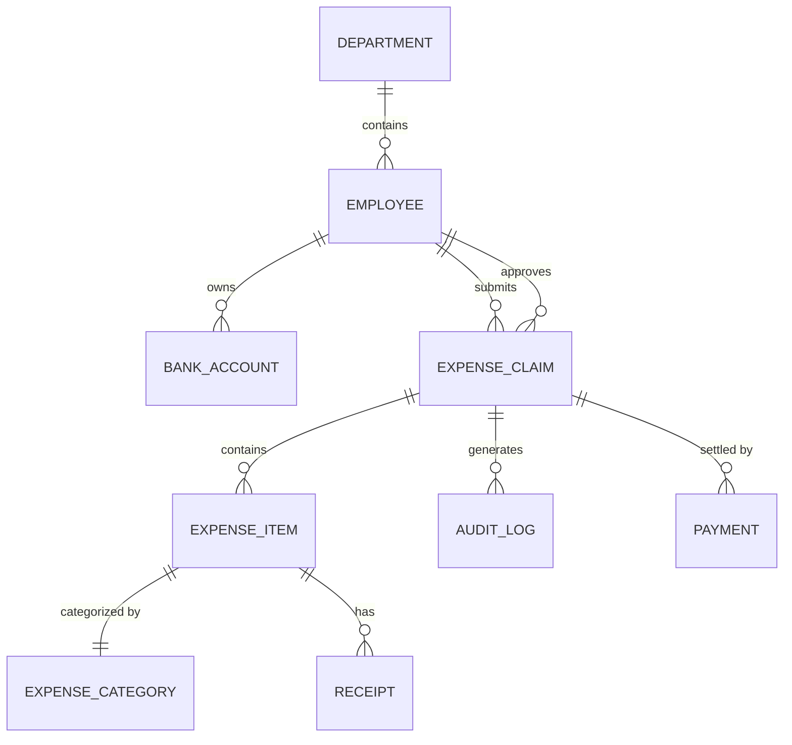

# Conceptual ERD — Expense Reimbursement System

## Mermaid Code

## Entity Description Table | Bang mo ta Entity

| # | Entity Name | Vietnamese Name | Description | Key Attributes | Main Relationships |
|---|-------------|-----------------|-------------|----------------|-------------------|
| 1 | DEPARTMENT | Phong ban | Phong ban cua nhan vien | id, name | contains EMPLOYEE |
| 2 | EMPLOYEE | Nhan vien | Nguoi su dung he thong | id, name, email | submits EXPENSE_CLAIM |
| 3 | BANK_ACCOUNT | Tai khoan ngan hang | Thong tin de nhan tien hoan | id, account_number | belongs to EMPLOYEE |
| 4 | EXPENSE_CLAIM | Don hoan tien | Yeu cau thanh toan chi phi | id, status, total_amount | contains EXPENSE_ITEM |
| 5 | EXPENSE_ITEM | Muc chi phi | Chi tiet tung khoan chi phi | id, amount, date | categorized by EXPENSE_CATEGORY |
| 6 | EXPENSE_CATEGORY| Danh muc chi phi | Loai chi phi (VD: an uong, di lai) | id, category_name | applied to EXPENSE_ITEM |
| 7 | RECEIPT | Hoa don | Minh chung cho chi phi | id, file_path | belongs to EXPENSE_ITEM |
| 8 | AUDIT_LOG | Nhat ky duyet | Lich su thay doi trang thai | id, action, timestamp | belongs to EXPENSE_CLAIM |
| 9 | PAYMENT | Giao dich thanh toan| Thong tin lenh chuyen tien | id, transaction_id | belongs to EXPENSE_CLAIM |

## Relationship Description | Mo ta Quan he

| # | From Entity | Cardinality | To Entity | Relationship Label | Business Explanation |
|---|-------------|-------------|-----------|-------------------|----------------------|
| 1 | DEPARTMENT | one-to-many | EMPLOYEE | contains | Mot phong ban co nhieu nhan vien. |
| 2 | EMPLOYEE | one-to-many | BANK_ACCOUNT | owns | Mot nhan vien co the co nhieu tai khoan ngan hang. |
| 3 | EMPLOYEE | one-to-many | EXPENSE_CLAIM | submits | Mot nhan vien co the nop nhieu don hoan tien. |
| 4 | EMPLOYEE | one-to-many | EXPENSE_CLAIM | approves | Mot quan ly (employee) co the duyet nhieu don. |
| 5 | EXPENSE_CLAIM | one-to-many | EXPENSE_ITEM | contains | Mot don co the chua nhieu khoan chi phi. |
| 6 | EXPENSE_CATEGORY| one-to-many | EXPENSE_ITEM | categorized by | Mot danh muc duoc gan cho nhieu muc chi phi. |
| 7 | EXPENSE_ITEM | one-to-many | RECEIPT | has | Mot muc chi phi co the co nhieu hoa don chung minh. |
| 8 | EXPENSE_CLAIM | one-to-many | AUDIT_LOG | generates | Mot don hoan tien sinh ra nhieu nhat ky lich su duyet. |
| 9 | EXPENSE_CLAIM | one-to-many | PAYMENT | settled by | Mot don hoan tien co the duoc tra qua nhieu giao dich thanh toan (hoac 1). |
