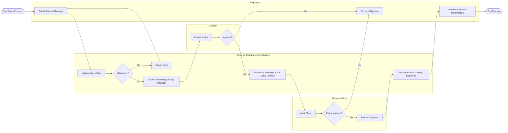

# Swimlane Diagram — Expense Reimbursement System

## Mermaid Code

## Flow Description | Mo ta luong

| Lane | Actor | Role in Flow |
|------|-------|-------------|
| 1 | Employee | Nguoi nop don hoan tien cung cac hoa don va nhan thong bao ket qua cuoi cung. |
| 2 | Expense Reimbursement System | He thong kiem tra du lieu, dieu phoi luong trang thai va gui thong bao toi cac ben lien quan. |
| 3 | Manager | Kiem tra su phu hop cua chi phi voi muc tieu cong viec va duyet don cho nhan vien thuoc quyen. |
| 4 | Finance Officer | Kiem toan don dua tren chinh sach tai chinh, kiem tra hoa don va thuc hien thanh toan thuc te. |
