# Action Tree — Expense Reimbursement System

## Mermaid Code

```mermaid
%%{init: {'theme': 'default'}}%%
graph TD
    Root["Expense Reimbursement System"]

    Root --> M1["Claim Management"]
    Root --> M2["Approval Workflow"]
    Root --> M3["Financial Processing"]
    Root --> M4["Policy & Settings"]
    Root --> M5["Reporting & Analytics"]

    M1 --> A11["Create Expense Claim"]
    M1 --> A12["Upload Digital Receipts"]
    M1 --> A13["Track Claim Status"]
    M1 --> A14["Withdraw Claim"]

    M2 --> A21["Review Pending Claims"]
    M2 --> A22["Approve Claims"]
    M2 --> A23["Reject with Comments"]
    M2 --> A24["Request More Information"]

    M3 --> A31["Audit Expense Items"]
    M3 --> A32["Process Reimbursement"]
    M3 --> A33["Sync with Accounting"]
    M3 --> A34["Handle Payment Failures"]

    M4 --> A41["Manage Expense Limits"]
    M4 --> A42["Configure Categories"]
    M4 --> A43["Manage User Roles"]

    M5 --> A51["Generate Spending Reports"]
    M5 --> A52["Export Audit Trails"]
    M5 --> A53["Analyze Department Costs"]
```

## Module Description | Mo ta Module

| # | Module | Description | Actions |
|---|--------|-------------|---------|
| 1 | Claim Management | Quan ly qua trinh tao va theo doi don chi phi cua nhan vien | Create Expense Claim, Upload Digital Receipts, Track Claim Status, Withdraw Claim |
| 2 | Approval Workflow | Quy trinh xet duyet don danh cho cap quan ly | Review Pending Claims, Approve Claims, Reject with Comments, Request More Information |
| 3 | Financial Processing | Kiem toan, thanh toan va dong bo voi ke toan | Audit Expense Items, Process Reimbursement, Sync with Accounting, Handle Payment Failures |
| 4 | Policy & Settings | Thiet lap chinh sach chi tieu va quan tri he thong | Manage Expense Limits, Configure Categories, Manage User Roles |
| 5 | Reporting & Analytics | Bao cao chi phi va phan tich du lieu theo phong ban | Generate Spending Reports, Export Audit Trails, Analyze Department Costs |
