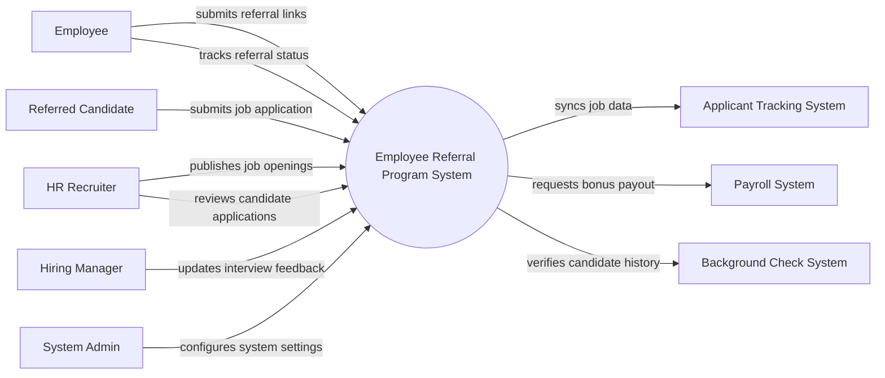

# Context Diagram — Employee Referral Program System

## Mermaid Code

## Actor & Interaction Table | Bang Actor & Tuong tac

| # | Actor | Actor Type | Data Sent TO System | Data Received FROM System | Notes |
|---|-------|------------|---------------------|---------------------------|-------|
| 1 | Employee | Primary | Referral submissions, candidate details | Referral statuses, bonus notifications | Nhan vien gioi thieu ung vien |
| 2 | Referred Candidate | Primary | Application details, resumes | Application status updates, interview schedules | Ung vien duoc gioi thieu |
| 3 | HR Recruiter | Primary | Job postings, application review statuses | New referral alerts, candidate profiles | Chuyen vien tuyen dung |
| 4 | Hiring Manager | Primary | Interview feedback, hiring decisions | Candidate profiles, interview schedules | Quan ly tuyen dung |
| 5 | System Admin | Primary | System configurations, user roles, reward rules | System logs, audit reports | Quan tri he thong |
| 6 | Applicant Tracking System | Supporting | Job requirement updates | Candidate sync data | He thong quan ly tuyen dung chung |
| 7 | Payroll System | Supporting | Payout confirmation | Bonus payment requests | He thong tinh luong de tra thuong |
| 8 | Background Check System | Supporting | Verification reports | Candidate verification requests | He thong kiem tra ly lich |

## System Boundary Description | Mo ta Pham vi He thong

The Employee Referral Program System manages the end-to-end process of internal job referrals, allowing employees to refer candidates and track their progress. It handles job postings specifically for referrals, candidate applications, interview feedback, and bonus tracking. The system integrates with external Applicant Tracking Systems for overall recruitment management and Payroll Systems to process referral rewards. However, the system does not conduct the actual background checks or disburse payments directly.
