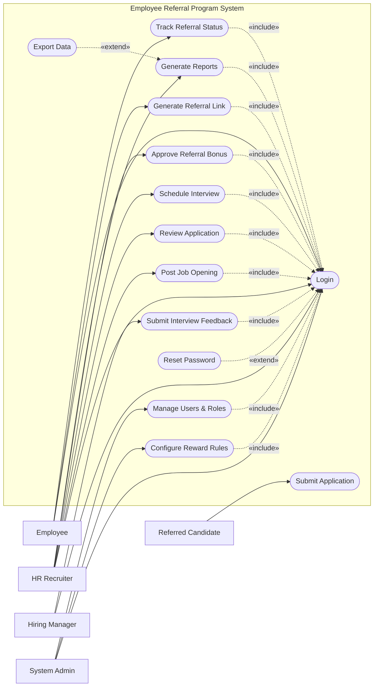

# Use Case Diagram — Employee Referral Program System

## Mermaid Code

## Actor Table | Bang Actor

| # | Actor | Actor Type | Role Description | Related Use Cases |
|---|-------|------------|------------------|-------------------|
| 1 | Employee | Primary | Nhan vien tao link va theo doi tien do gioi thieu | UC01, UC02, UC03 |
| 2 | Referred Candidate | Primary | Ung vien nop don qua link gioi thieu | UC04 |
| 3 | HR Recruiter | Primary | Nguoi quan ly chien dich tuyen dung va danh gia ung vien | UC01, UC05, UC06, UC07, UC09, UC10 |
| 4 | Hiring Manager | Primary | Nguoi phong van va ra quyet dinh tuyen dung | UC01, UC08 |
| 5 | System Admin | Primary | Quan tri vien cai dat he thong va luat thuong | UC01, UC11, UC12 |

## Use Case Table | Bang Use Case

| # | UC ID | Use Case Name | Primary Actor | Secondary Actor | Description | Priority |
|---|-------|---------------|---------------|-----------------|-------------|----------|
| 1 | UC01 | Login | Employee | | Authenticate user access | High |
| 2 | UC02 | Generate Referral Link | Employee | | Create a unique tracking link for a job | High |
| 3 | UC03 | Track Referral Status | Employee | | View the progress of referred candidates | Medium |
| 4 | UC04 | Submit Application | Referred Candidate | | Apply for a job using the referral link | High |
| 5 | UC05 | Post Job Opening | HR Recruiter | | Publish a new job for the referral program | High |
| 6 | UC06 | Review Application | HR Recruiter | | Evaluate submitted candidate applications | High |
| 7 | UC07 | Schedule Interview | HR Recruiter | | Arrange interview sessions with candidates | Medium |
| 8 | UC08 | Submit Interview Feedback| Hiring Manager | | Record evaluation results post-interview | High |
| 9 | UC09 | Approve Referral Bonus | HR Recruiter | Payroll System | Trigger bonus payment for successful hires | High |
| 10| UC10 | Generate Reports | HR Recruiter | | Create statistical referral performance reports | Medium |
| 11| UC11 | Configure Reward Rules | System Admin | | Set up conditions and amounts for bonuses | Medium |
| 12| UC12 | Manage Users & Roles | System Admin | | Manage system accounts and permissions | High |
| 13| UC13 | Reset Password | Employee | | Recover account access | High |
| 14| UC14 | Export Data | HR Recruiter | | Download reports as external files | Low |

## Use Case Specification | Dac ta Use Case

---

### UC01 — Login

| Field | Detail |
|-------|--------|
| **UC ID** | UC01 |
| **Use Case Name** | Login |
| **Actor(s)** | Primary: Employee, HR Recruiter, Hiring Manager, System Admin |
| **Description** | Cho phep nguoi dung xac thuc de dang nhap vao he thong. |
| **Precondition** | 1. Nguoi dung phai co tai khoan hop le tren he thong.  2. He thong dang hoat dong binh thuong. |
| **Main Flow** | 1. Actor mo trang dang nhap.  2. System hien thi form dang nhap.  3. Actor nhap username va password.  4. Actor nhan nut Submit.  5. System xac thuc thong tin.  6. System chuyen huong den trang chu tuong ung quyen han. |
| **Alternative Flow** | **AF1** — Quen mat khau: Neu Actor chon "Forgot Password", System kich hoat UC13 Reset Password. |
| **Exception Flow** | **EX1** — Sai thong tin: Neu xac thuc that bai, System hien thi thong bao loi va yeu cau nhap lai.  **EX2** — Tai khoan bi khoa: Neu nhap sai qua 5 lan, System khoa tai khoan va thong bao lien he Admin. |
| **Postcondition** | Nguoi dung duoc dang nhap va phien lam viec duoc khoi tao. |
| **Business Rule** | **BR1**: Mat khau phai duoc ma hoa.  **BR2**: Phien dang nhap tu dong het han sau 30 phut khong hoat dong. |

---

### UC02 — Generate Referral Link

| Field | Detail |
|-------|--------|
| **UC ID** | UC02 |
| **Use Case Name** | Generate Referral Link |
| **Actor(s)** | Primary: Employee |
| **Description** | Nhan vien tao link gioi thieu ung vien cho mot vi tri cong viec cu essential. |
| **Precondition** | 1. Nhan vien da dang nhap (Include UC01).  2. Vi tri cong viec dang o trang thai mo (Open). |
| **Main Flow** | 1. Actor chon mot cong viec tu danh sach "Active Jobs".  2. Actor nhan nut "Generate Referral Link".  3. System tao mot URL doc nhat gan voi ma ID cua nhan vien do.  4. System hien thi link tren man hinh kem nut Copy.  5. Actor copy link va gui cho ung vien. |
| **Alternative Flow** | **AF1** — Chia se truc tiep: Actor chon chia se qua email/mang xa hoi tu dong thay vi copy thu cong. |
| **Exception Flow** | **EX1** — Cong viec da dong: Neu cong viec vua bi dong, System hien thi loi va khong tao link. |
| **Postcondition** | Link gioi thieu doc nhat duoc tao va luu trong lich su he thong. |
| **Business Rule** | **BR1**: Moi link gioi thieu chi co hieu luc den khi cong viec dong.  **BR2**: Link phai chua ma dinh danh duy nhat de theo doi. |

---

### UC04 — Submit Application

| Field | Detail |
|-------|--------|
| **UC ID** | UC04 |
| **Use Case Name** | Submit Application |
| **Actor(s)** | Primary: Referred Candidate |
| **Description** | Ung vien dien thong tin va nop ho so thong qua link gioi thieu. |
| **Precondition** | 1. Ung vien truy cap vao link gioi thieu hop le.  2. Cong viec van dang con mo. |
| **Main Flow** | 1. Actor truy cap link va xem thong tin cong viec.  2. Actor dien form thong tin ca nhan (Ten, Email, Sdt).  3. Actor tai len CV/Resume.  4. Actor nhan "Submit Application".  5. System kiem tra thong tin bat buoc va dinh dang file.  6. System luu ho so, cap nhat trang thai, va thong bao cho HR Recruiter cung Employee gioi thieu. |
| **Alternative Flow** | **AF1** — Huy nop don: Truoc buoc 4, Actor tat trang va form khong duoc luu. |
| **Exception Flow** | **EX1** — Thieu thong tin: Neu de trong truong bat buoc, System hien thi loi va yeu cau bo sung.  **EX2** — Link het han: Neu cong viec da dong, System hien thi thong bao "Job Closed". |
| **Postcondition** | Ho so duoc luu vao he thong voi trang thai "New". |
| **Business Rule** | **BR1**: Kich thuoc CV khong duoc vuot qua 5MB.  **BR2**: Ung vien phai dong y voi dieu khoan bao mat du lieu. |

---

### UC06 — Review Application

| Field | Detail |
|-------|--------|
| **UC ID** | UC06 |
| **Use Case Name** | Review Application |
| **Actor(s)** | Primary: HR Recruiter |
| **Description** | HR xem xet ho so ung vien da nop va quyet dinh cac buoc tiep theo. |
| **Precondition** | 1. HR Recruiter da dang nhap (Include UC01).  2. Co ho so ung vien o trang thai "New" hoac "Pending Review". |
| **Main Flow** | 1. Actor chon ho so ung vien tu danh sach quan ly.  2. System hien thi thong tin chi tiet va CV cua ung vien.  3. Actor danh gia ho so.  4. Actor cap nhat trang thai thanh "Shortlisted" (Chon).  5. System luu trang thai va gui thong bao cho ung vien va nhan vien gioi thieu. |
| **Alternative Flow** | **AF1** — Loai ho so: O buoc 4, Actor chon "Rejected" va nhap ly do. System luu trang thai va gui email tu choi lich su. |
| **Exception Flow** | **EX1** — Ho so bi loi: Neu CV khong the mo, System hien thi thong bao loi va goi y HR lien he ung vien. |
| **Postcondition** | Trang thai ho so ung vien duoc cap nhat (Shortlisted hoac Rejected). |
| **Business Rule** | **BR1**: Ho so bi tu choi phai co ly do cu the luu tren he thong.  **BR2**: Khi ho so chuyen trang thai, nhan vien gioi thieu duoc phep xem cap nhat (nhung khong xem CV chi tiet). |

---

### UC09 — Approve Referral Bonus

| Field | Detail |
|-------|--------|
| **UC ID** | UC09 |
| **Use Case Name** | Approve Referral Bonus |
| **Actor(s)** | Primary: HR Recruiter, Secondary: Payroll System |
| **Description** | HR phe duyet tien thuong cho nhan vien khi ung vien da vuot qua thoi gian thu viec. |
| **Precondition** | 1. HR Recruiter da dang nhap (Include UC01).  2. Ung vien da duoc tuyen va hoan thanh thoi gian thu viec. |
| **Main Flow** | 1. Actor mo danh sach "Eligible Bonuses" tren he thong.  2. System hien thi cac nhan vien du dieu kien nhan thuong.  3. Actor chon mot ban ghi va nhan "Approve Bonus".  4. System cap nhat trang thai tien thuong thanh "Approved".  5. System gui yeu cau thanh toan sang Payroll System.  6. System thong bao cho nhan vien ve khoan thuong sap toi. |
| **Alternative Flow** | **AF1** — Tu choi: Actor chon "Reject" neu phat hien vi pham, nhap ly do, System cap nhat trang thai "Rejected". |
| **Exception Flow** | **EX1** — Loi ket noi Payroll: Neu Payroll System khong the ket noi o buoc 5, System bao loi "Sync failed" va dua vao hang cho. |
| **Postcondition** | Yeu cau tra thuong duoc gui den he thong luong va trang thai thuong duoc cap nhat. |
| **Business Rule** | **BR1**: Thuong chi duoc duyet khi ung vien lam viec tren 2 thang (hoac tuy luat).  **BR2**: So tien thuong phai khop voi quy tac luu trong he thong tai thoi diem gioi thieu. |
