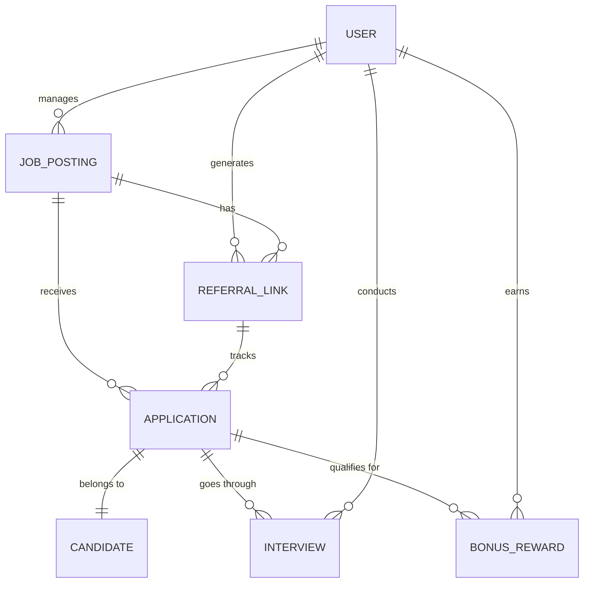

# Conceptual ERD — Employee Referral Program System

## Mermaid Code

## Entity Description Table | Bang mo ta Entity

| # | Entity Name | Vietnamese Name | Description | Key Attributes | Main Relationships |
|---|-------------|-----------------|-------------|----------------|-------------------|
| 1 | USER | Nguoi dung | Tai khoan cua Employee, HR, Manager, Admin | user_id, role, name | generates REFERRAL_LINK, earns BONUS_REWARD |
| 2 | JOB_POSTING | Vi tri tuyen dung | Thong tin cong viec dang mo de gioi thieu | job_id, title, status | receives APPLICATION |
| 3 | REFERRAL_LINK | Link gioi thieu | Duong dan doc nhat do nhan vien tao | link_id, url, created_at | tracks APPLICATION |
| 4 | CANDIDATE | Ung vien | Thong tin ca nhan cua nguoi duoc gioi thieu | candidate_id, email, phone | applies via APPLICATION |
| 5 | APPLICATION | Ho so ung tuyen | Don ung tuyen cua ung vien vao mot cong viec | application_id, status, resume | belongs to CANDIDATE, qualifies for BONUS_REWARD |
| 6 | INTERVIEW | Lich phong van | Thong tin cac vong phong van cua ung vien | interview_id, schedule, feedback | conducted by USER |
| 7 | BONUS_REWARD | Phan thuong | Thong tin tien thuong cho nhan vien gioi thieu | reward_id, amount, status | earned by USER |

## Relationship Description | Mo ta Quan he

| # | From Entity | Cardinality | To Entity | Relationship Label | Business Explanation |
|---|-------------|-------------|-----------|-------------------|----------------------|
| 1 | USER | one-to-many | JOB_POSTING | manages | HR (User) quan ly nhieu bai tuyen dung. |
| 2 | USER | one-to-many | REFERRAL_LINK | generates | Mot nhan vien tao nhieu link gioi thieu. |
| 3 | JOB_POSTING | one-to-many | REFERRAL_LINK | has | Mot cong viec co the co nhieu link gioi thieu duoc tao ra. |
| 4 | JOB_POSTING | one-to-many | APPLICATION | receives | Mot cong viec nhan nhieu ho so ung tuyen. |
| 5 | REFERRAL_LINK | one-to-many | APPLICATION | tracks | Mot link gioi thieu co the ghi nhan nhieu ung vien ung tuyen. |
| 6 | APPLICATION | one-to-one | CANDIDATE | belongs to | Mot ho so thuoc ve mot ung vien. |
| 7 | APPLICATION | one-to-many | INTERVIEW | goes through | Mot ho so ung tuyen co the qua nhieu vong phong van. |
| 8 | USER | one-to-many | INTERVIEW | conducts | Mot Hiring Manager (User) co the tien hanh nhieu buoi phong van. |
| 9 | APPLICATION | one-to-many | BONUS_REWARD | qualifies for | Mot ho so thanh cong tao ra mot khoan thuong. |
| 10| USER | one-to-many | BONUS_REWARD | earns | Mot nhan vien (User) co the nhan nhieu khoan thuong. |
