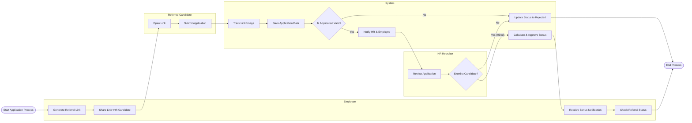

# Swimlane Diagram — Employee Referral Program System

## Mermaid Code

## Flow Description | Mo ta luong

| Lane | Actor | Role in Flow |
|------|-------|-------------|
| 1 | Employee | Nguoi tao link, gui cho ung vien va theo doi trang thai de nhan thuong. |
| 2 | Referred Candidate | Nguoi su dung link de nop don ung tuyen vao he thong. |
| 3 | System | He thong theo doi link, kiem tra form hop le, cap nhat trang thai va tinh thuong. |
| 4 | HR Recruiter | Nguoi xem xet ho so do he thong gui toi va ra quyet dinh tuyen dung. |
