# Action Tree — Employee Referral Program System

## Mermaid Code

```mermaid
%%{init: {'theme': 'default'}}%%
graph TD
    Root["Employee Referral Program System"]

    Root --> M1["Referral Management"]
    Root --> M2["Application Management"]
    Root --> M3["Job Management"]
    Root --> M4["Bonus & Reward"]
    Root --> M5["System Settings"]

    M1 --> A11["Generate Referral Link"]
    M1 --> A12["Track Referral Status"]
    M1 --> A13["Share Link via Email"]

    M2 --> A21["Submit Application"]
    M2 --> A22["Review Application"]
    M2 --> A23["Schedule Interview"]
    M2 --> A24["Submit Interview Feedback"]

    M3 --> A31["Post Job Opening"]
    M3 --> A32["Update Job Details"]
    M3 --> A33["Close Job Posting"]

    M4 --> A41["Approve Referral Bonus"]
    M4 --> A42["Sync with Payroll"]
    M4 --> A43["Track Payment History"]

    M5 --> A51["Configure Reward Rules"]
    M5 --> A52["Manage Users & Roles"]
    M5 --> A53["Generate Reports"]
    M5 --> A54["Export Data"]
```

## Module Description | Mo ta Module

| # | Module | Description | Actions |
|---|--------|-------------|---------|
| 1 | Referral Management | Quan ly qua trinh tao link va theo doi tien do gioi thieu cua nhan vien | Generate Referral Link, Track Referral Status, Share Link via Email |
| 2 | Application Management | Xu ly ho so ung tuyen tu ung vien do gioi thieu mang lai | Submit Application, Review Application, Schedule Interview, Submit Interview Feedback |
| 3 | Job Management | Dang tai va quan ly cac vi tri can gioi thieu | Post Job Opening, Update Job Details, Close Job Posting |
| 4 | Bonus & Reward | Tinh toan, duyet va gui yeu cau thuong cho nhan vien | Approve Referral Bonus, Sync with Payroll, Track Payment History |
| 5 | System Settings | Quan tri cau hinh he thong, phan quyen va bao cao | Configure Reward Rules, Manage Users & Roles, Generate Reports, Export Data |
