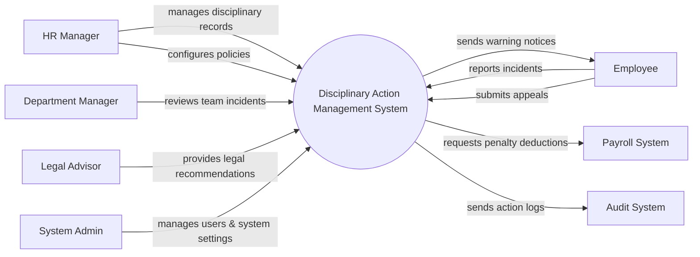

# Context Diagram — Disciplinary Action Management System

## Mermaid Code

## Actor & Interaction Table | Bang Actor & Tuong tac

| # | Actor | Actor Type | Data Sent TO System | Data Received FROM System | Notes |
|---|-------|------------|---------------------|---------------------------|-------|
| 1 | HR Manager | Primary | Disciplinary decisions, policy configurations | Incident reports, investigation summaries | Nguoi quan ly ky luat |
| 2 | Employee | Primary | Incident reports, appeal requests | Notifications, warning letters | Nhan vien |
| 3 | Department Manager | Primary | Incident reviews | Team disciplinary reports | Quan ly bo phan |
| 4 | Legal Advisor | Supporting | Legal recommendations | Case details | Co van phap ly |
| 5 | Payroll System | Supporting | Deduction status | Penalty deduction requests | He thong tinh luong |
| 6 | Audit System | Supporting | Audit confirmation | System action logs | He thong kiem toan |
| 7 | System Admin | Primary | System configurations, user roles | System logs, error reports | Quan tri he thong |

## System Boundary Description | Mo ta Pham vi He thong

The Disciplinary Action Management System is responsible for recording workplace incidents, managing investigations, and tracking disciplinary actions and appeals. It provides a centralized platform for HR Managers, employees, and legal advisors to collaborate on disciplinary cases. The system does not directly process payroll deductions but integrates with external Payroll Systems for financial penalties. It also sends logs to an Audit System for compliance but does not conduct external audits.
