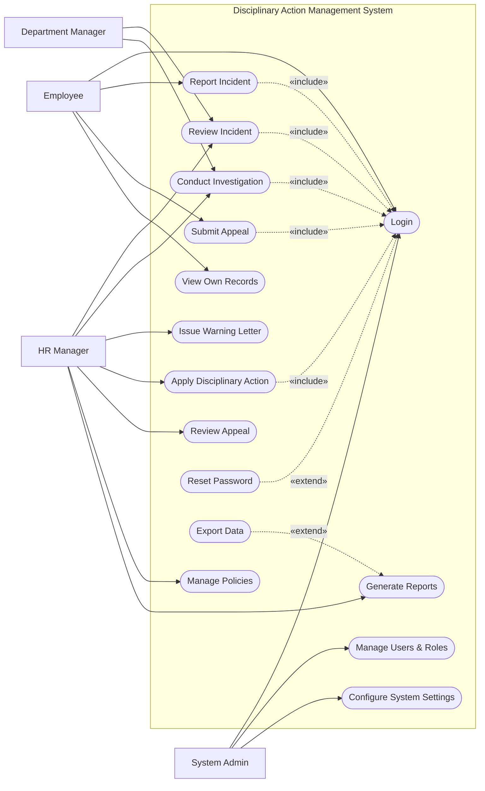

# Use Case Diagram — Disciplinary Action Management System

## Mermaid Code

## Actor Table | Bang Actor

| # | Actor | Actor Type | Role Description | Related Use Cases |
|---|-------|------------|------------------|-------------------|
| 1 | Employee | Primary | Nhan vien bao cao su co hoac bi ky luat | UC01, UC02, UC07, UC11 |
| 2 | Department Manager | Primary | Quan ly cua nhan vien bi lien quan | UC03, UC04 |
| 3 | HR Manager | Primary | Nguoi xu ly chinh cac vi pham | UC03, UC04, UC05, UC06, UC08, UC09, UC10 |
| 4 | System Admin | Primary | Quan tri he thong | UC01, UC14, UC15 |

## Use Case Table | Bang Use Case

| # | UC ID | Use Case Name | Primary Actor | Secondary Actor | Description | Priority |
|---|-------|---------------|---------------|-----------------|-------------|----------|
| 1 | UC01 | Login | Employee | | Authenticate user access | High |
| 2 | UC02 | Report Incident | Employee | | Submit a new incident report | High |
| 3 | UC03 | Review Incident | HR Manager | Department Manager | Review reported incidents | High |
| 4 | UC04 | Conduct Investigation | HR Manager | Department Manager | Record investigation details | Medium |
| 5 | UC05 | Issue Warning Letter | HR Manager | | Generate and send warning letters | High |
| 6 | UC06 | Apply Disciplinary Action | HR Manager | | Execute formal disciplinary steps | High |
| 7 | UC07 | Submit Appeal | Employee | | Appeal against an action | Medium |
| 8 | UC08 | Review Appeal | HR Manager | | Review and decide on appeals | Medium |
| 9 | UC09 | Manage Policies | HR Manager | | Update company HR policies | Low |
| 10| UC10 | Generate Reports | HR Manager | | Generate disciplinary reports | Medium |
| 11| UC11 | View Own Records | Employee | | View personal disciplinary history | Low |
| 12| UC12 | Reset Password | Employee | | Recover account access | High |
| 13| UC13 | Export Data | HR Manager | | Export case data to files | Low |
| 14| UC14 | Manage Users & Roles | System Admin | | Manage user access | High |
| 15| UC15 | Configure System Settings | System Admin | | Configure system parameters | Medium |

## Use Case Specification | Dac ta Use Case

---

### UC01 — Login

| Field | Detail |
|-------|--------|
| **UC ID** | UC01 |
| **Use Case Name** | Login |
| **Actor(s)** | Primary: Employee, HR Manager, Department Manager, System Admin |
| **Description** | Cho phep nguoi dung xac thuc de dang nhap vao he thong. |
| **Precondition** | 1. Nguoi dung phai co tai khoan hop le tren he thong.  2. He thong dang hoat dong binh thuong. |
| **Main Flow** | 1. Actor mo trang dang nhap.  2. System hien thi form dang nhap.  3. Actor nhap username va password.  4. Actor nhan nut Submit.  5. System xac thuc thong tin.  6. System chuyen huong den trang chu tuong ung. |
| **Alternative Flow** | **AF1** — Quen mat khau: Neu Actor chon "Forgot Password", System kich hoat UC12 Reset Password. |
| **Exception Flow** | **EX1** — Sai thong tin: Neu xac thuc that bai, System hien thi thong bao loi va yeu cau nhap lai.  **EX2** — Tai khoan bi khoa: Neu nhap sai qua 5 lan, System khoa tai khoan. |
| **Postcondition** | Nguoi dung dang nhap thanh cong. |
| **Business Rule** | **BR1**: Mat khau phai duoc ma hoa.  **BR2**: Phien dang nhap het han sau 30 phut. |

---

### UC02 — Report Incident

| Field | Detail |
|-------|--------|
| **UC ID** | UC02 |
| **Use Case Name** | Report Incident |
| **Actor(s)** | Primary: Employee |
| **Description** | Nhan vien bao cao mot su co hoac vi pham trong cong ty. |
| **Precondition** | 1. Nhan vien da dang nhap (Include UC01). |
| **Main Flow** | 1. Actor chon "Report Incident".  2. System hien thi form dien thong tin.  3. Actor dien ngay gio, dia diem, mo ta va nguoi lien quan.  4. Actor nhan Submit.  5. System xac nhan thong tin hop le.  6. System luu ban ghi va thong bao den HR Manager. |
| **Alternative Flow** | **AF1** — Dinh kem file: Actor co extreme upload hinh anh/video bang chung o buoc 3. |
| **Exception Flow** | **EX1** — Thieu thong tin: Neu bo trong truong bat buoc, System bao loi va chan Submit. |
| **Postcondition** | Incident duoc luu voi trang thai "New". |
| **Business Rule** | **BR1**: Nguoi bao cao co the chon an danh.  **BR2**: File dinh kem khong qua 10MB. |

---

### UC04 — Conduct Investigation

| Field | Detail |
|-------|--------|
| **UC ID** | UC04 |
| **Use Case Name** | Conduct Investigation |
| **Actor(s)** | Primary: HR Manager / Secondary: Department Manager |
| **Description** | Ghi nhan ket qua dieu tra cua mot su co da bao cao. |
| **Precondition** | 1. Incident dang o trang thai "Under Investigation". |
| **Main Flow** | 1. Actor mo chi tiet Incident.  2. Actor chon "Update Investigation".  3. System hien thi form dieu tra.  4. Actor nhap chi tiet phong van, bang chung moi.  5. Actor nhan Save.  6. System luu lai ket qua dieu tra. |
| **Alternative Flow** | **AF1** — Ket luan: Neu dieu tra hoan tat, Actor chon "Conclude" de chuyen trang thai sang "Resolved". |
| **Exception Flow** | **EX1** — Incident da dong: Neu su co da bi huy hoac hoan thanh, System khong cho phep chinh sua. |
| **Postcondition** | Thong tin dieu tra duoc cap nhat vao ho so su co. |
| **Business Rule** | **BR1**: Moi thay doi trong ho so dieu tra deu duoc luu log.  **BR2**: Chi HR Manager duoc quyen Conclude. |

---

### UC06 — Apply Disciplinary Action

| Field | Detail |
|-------|--------|
| **UC ID** | UC06 |
| **Use Case Name** | Apply Disciplinary Action |
| **Actor(s)** | Primary: HR Manager |
| **Description** | Ban hanh quyet dinh ky luat chinh thuc doi voi nhan vien vi pham. |
| **Precondition** | 1. Incident da duoc dieu tra va xac nhan co vi pham. |
| **Main Flow** | 1. Actor chon Incident can xu ly.  2. Actor chon "Apply Action".  3. System hien thi danh sach cac muc phat.  4. Actor chon muc phat, nhap ly do va chon nhan vien.  5. Actor nhan Submit.  6. System luu ho so, cap nhat trang thai va gui thong bao. |
| **Alternative Flow** | **AF1** — Gui Payroll: Neu la phat tien, System tu dong tao request gui Payroll System. |
| **Exception Flow** | **EX1** — Chua dieu tra: Neu Incident chua co ket luan, System chan viec ap dung ky luat. |
| **Postcondition** | Ho so ky luat duoc tao va luu vao lich su cua nhan vien. |
| **Business Rule** | **BR1**: Hinh phat sa thai phai co xac nhan tu cap cao nhat.  **BR2**: Moi quyet dinh ky luat phai cho phep nhan vien Appeal trong 7 ngay. |
