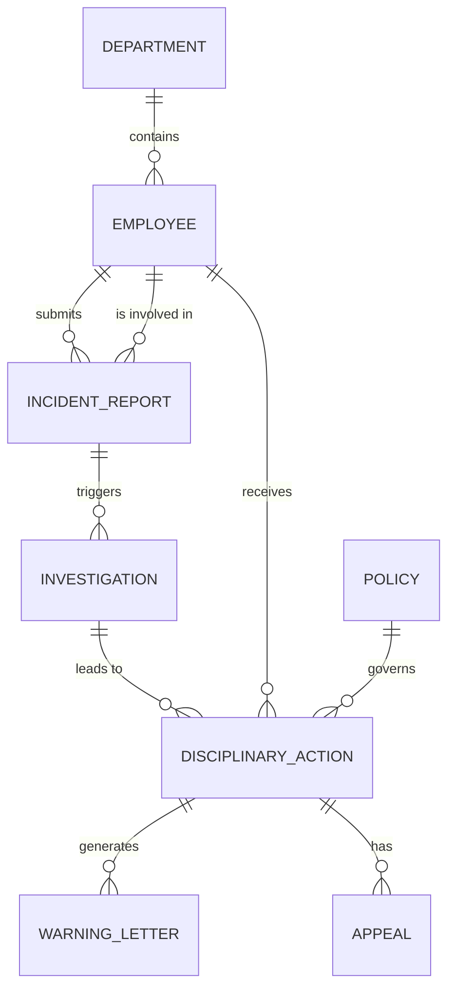

# Conceptual ERD — Disciplinary Action Management System

## Mermaid Code

## Entity Description Table | Bang mo ta Entity

| # | Entity Name | Vietnamese Name | Description | Key Attributes | Main Relationships |
|---|-------------|-----------------|-------------|----------------|-------------------|
| 1 | DEPARTMENT | Phong ban | Thong tin cac phong ban | department_id, name, code, manager_id | contains EMPLOYEE |
| 2 | EMPLOYEE | Nhan vien | Ho so nhan vien | employee_id, name, email, department_id | submits INCIDENT_REPORT, receives DISCIPLINARY_ACTION |
| 3 | INCIDENT_REPORT | Bao cao su co | Ghi nhan vi pham/su co | incident_id, date, description, status, reporter_id | triggers INVESTIGATION |
| 4 | INVESTIGATION | Ho so dieu tra | Chi tiet qua trinh dieu tra | investigation_id, incident_id, findings, investigator_id | leads to DISCIPLINARY_ACTION |
| 5 | DISCIPLINARY_ACTION | Quyet dinh ky luat | Ket qua phat cuoi cung | action_id, type, date, reason, employee_id | generates WARNING_LETTER, has APPEAL |
| 6 | WARNING_LETTER | Thu canh cao | Tai lieu canh cao chinh thuc | letter_id, action_id, content, sent_date | belongs to DISCIPLINARY_ACTION |
| 7 | APPEAL | Don khieu nai | Khieu nai cua nhan vien | appeal_id, action_id, reason, status, employee_id | belongs to DISCIPLINARY_ACTION |
| 8 | POLICY | Chinh sach ky luat | Cac quy dinh cua cong ty | policy_id, title, description, severity_level | governs DISCIPLINARY_ACTION |

## Relationship Description | Mo ta Quan he

| # | From Entity | Cardinality | To Entity | Relationship Label | Business Explanation |
|---|-------------|-------------|-----------|-------------------|----------------------|
| 1 | DEPARTMENT | one-to-many | EMPLOYEE | contains | Mot phong ban bao gom nhieu nhan vien. |
| 2 | EMPLOYEE | one-to-many | INCIDENT_REPORT | submits | Mot nhan vien co the bao cao nhieu su co. |
| 3 | EMPLOYEE | one-to-many | INCIDENT_REPORT | is involved in | Mot nhan vien co the bi cao buoc trong nhieu su co. |
| 4 | INCIDENT_REPORT | one-to-many | INVESTIGATION | triggers | Mot su co co the yeu cau nhieu cuoc dieu tra/phien hop. |
| 5 | INVESTIGATION | one-to-many | DISCIPLINARY_ACTION | leads to | Dieu tra co the dan den viec ap dung cac hinh phat. |
| 6 | EMPLOYEE | one-to-many | DISCIPLINARY_ACTION | receives | Mot nhan vien co the nhan nhieu quyet dinh ky luat khac nhau. |
| 7 | DISCIPLINARY_ACTION | one-to-many | WARNING_LETTER | generates | Mot quyet dinh co the sinh ra cac thu canh cao. |
| 8 | DISCIPLINARY_ACTION | one-to-many | APPEAL | has | Nhan vien co the nop don khieu nai cho mot quyet dinh ky luat. |
| 9 | POLICY | one-to-many | DISCIPLINARY_ACTION | governs | Mot quy dinh chinh sach chi phoi cach ap dung ky luat. |
