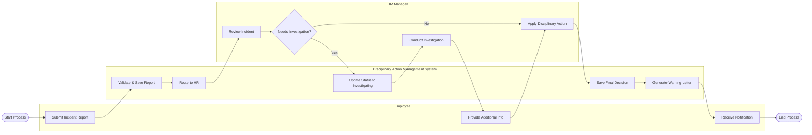

# Swimlane Diagram — Disciplinary Action Management System

## Mermaid Code

## Flow Description | Mo ta luong

| Lane | Actor | Role in Flow |
|------|-------|-------------|
| 1 | Employee | Nguoi bao cao su co, cung cap thong tin khi dieu tra va nhan ket qua. |
| 2 | Disciplinary Action Management System | He thong luu tru, validate, chuyen huong va tu dong sinh thu canh cao. |
| 3 | HR Manager | Nguoi doc bao cao, quyet dinh dieu tra va dua ra muc phat ky luat. |
