# Action Tree — Disciplinary Action Management System

## Mermaid Code

```mermaid
%%{init: {'theme': 'default'}}%%
graph TD
    Root["Disciplinary Action Management System"]

    Root --> M1["Incident Management"]
    Root --> M2["Investigation Management"]
    Root --> M3["Action & Resolution"]
    Root --> M4["Appeal Management"]
    Root --> M5["System Administration"]

    M1 --> A11["Report Incident"]
    M1 --> A12["Review Incident"]
    M1 --> A13["Track Incident Status"]

    M2 --> A21["Assign Investigator"]
    M2 --> A22["Conduct Investigation"]
    M2 --> A23["Log Evidence"]
    M2 --> A24["Conclude Findings"]

    M3 --> A31["Issue Warning Letter"]
    M3 --> A32["Apply Salary Deduction"]
    M3 --> A33["Suspend Employee"]
    M3 --> A34["Terminate Employee"]

    M4 --> A41["Submit Appeal"]
    M4 --> A42["Review Appeal"]
    M4 --> A43["Finalize Decision"]

    M5 --> A51["Manage User Access"]
    M5 --> A52["Configure Policies"]
    M5 --> A53["Audit System Logs"]
```

## Module Description | Mo ta Module

| # | Module | Description | Actions |
|---|--------|-------------|---------|
| 1 | Incident Management | Quan ly tiep nhan va xac minh su co vi pham ban dau | Report Incident, Review Incident, Track Incident Status |
| 2 | Investigation Management | Quan ly qua trinh dieu tra va thu thap chung cu | Assign Investigator, Conduct Investigation, Log Evidence, Conclude Findings |
| 3 | Action & Resolution | Ap dung cac hinh thuc ky luat doi voi nhan vien | Issue Warning Letter, Apply Salary Deduction, Suspend Employee, Terminate Employee |
| 4 | Appeal Management | Xu ly cac don khieu nai cua nhan vien sau khi bi ky luat | Submit Appeal, Review Appeal, Finalize Decision |
| 5 | System Administration | Quan tri he thong, phan quyen va thiet lap chinh sach | Manage User Access, Configure Policies, Audit System Logs |
