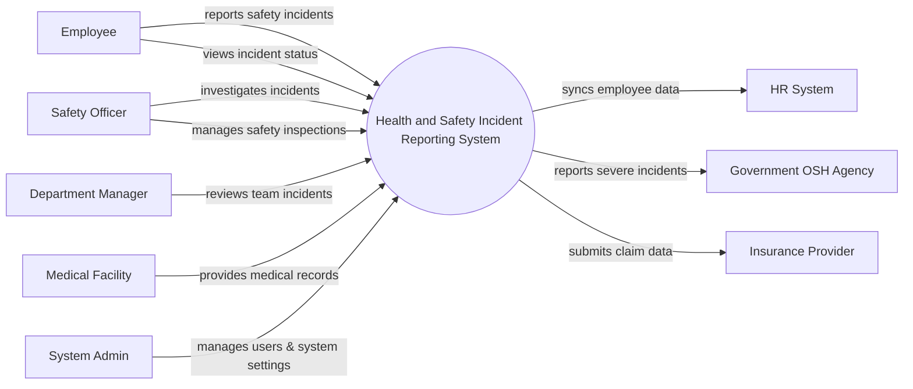

# Context Diagram — Health and Safety Incident Reporting System

## Mermaid Code

## Actor & Interaction Table | Bang Actor & Tuong tac

| # | Actor | Actor Type | Data Sent TO System | Data Received FROM System | Notes |
|---|-------|------------|---------------------|---------------------------|-------|
| 1 | Employee | Primary | Incident details, evidence, safety concerns | Incident status updates, safety alerts | Nhan vien thong thuong bao cao su co |
| 2 | Safety Officer | Primary | Investigation notes, corrective actions, inspection logs | Incident reports, compliance metrics | Chuyen vien an toan lao dong |
| 3 | Department Manager | Primary | Incident reviews, team safety feedback | Incident alerts, team safety reports | Quan ly bo phan co su co |
| 4 | System Admin | Primary | System configurations, user roles | System logs, audit reports | Quan tri he thong |
| 5 | HR System | Supporting | Employee data updates | Incident records for personnel files | He thong nhan su |
| 6 | Government OSH Agency | Regulatory | Compliance guidelines, regulations | Severe incident reports | Co quan an toan lao dong chinh phu |
| 7 | Medical Facility | Supporting | Medical reports, injury details | Patient verification data | Co so y te, benh vien |
| 8 | Insurance Provider | Supporting | Claim status, coverage policies | Medical claims, incident evidence | Cong ty bao hiem |

## System Boundary Description | Mo ta Pham vi He thong

The Health and Safety Incident Reporting System is responsible for logging, tracking, and investigating workplace safety incidents. It serves as the central platform for Employees to report hazards and for Safety Officers to manage corrective actions and compliance. The system does not directly handle medical treatments or insurance payouts; instead, it integrates with Medical Facilities and Insurance Providers to exchange necessary data. Additionally, it syncs personnel information from the external HR System and reports major incidents to Government Agencies as required by law.
