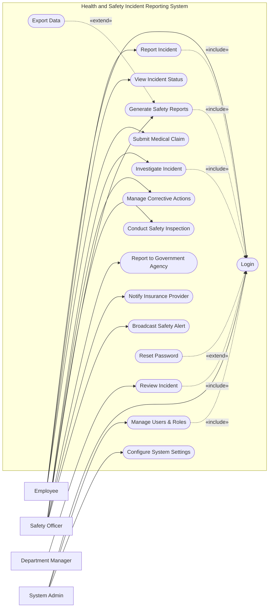

# Use Case Diagram — Health and Safety Incident Reporting System

## Mermaid Code

## Actor Table | Bang Actor

| # | Actor | Actor Type | Role Description | Related Use Cases |
|---|-------|------------|------------------|-------------------|
| 1 | Employee | Primary | Nhan vien trong cong ty gap hoac phat hien su co | UC01, UC02, UC03, UC09 |
| 2 | Department Manager | Primary | Nguoi quan ly truc tiep bo phan xay ra su co | UC04 |
| 3 | Safety Officer | Primary | Chuyen vien chiu trach nhiem ve an toan lao dong | UC05, UC06, UC07, UC08, UC10, UC11, UC12 |
| 4 | System Admin | Primary | Quan tri vien he thong, phan quyen va cai dat | UC01, UC15, UC16 |

## Use Case Table | Bang Use Case

| # | UC ID | Use Case Name | Primary Actor | Secondary Actor | Description | Priority |
|---|-------|---------------|---------------|-----------------|-------------|----------|
| 1 | UC01 | Login | Employee | | Authenticate user access | High |
| 2 | UC02 | Report Incident | Employee | | Submit a new safety incident or hazard | High |
| 3 | UC03 | View Incident Status | Employee | | Check the progress of a reported incident | Medium |
| 4 | UC04 | Review Incident | Department Manager | | Review an incident reported by a team member | High |
| 5 | UC05 | Investigate Incident | Safety Officer | | Conduct root cause analysis on an incident | High |
| 6 | UC06 | Manage Corrective Actions | Safety Officer | | Track and resolve safety issues | High |
| 7 | UC07 | Conduct Safety Inspection | Safety Officer | | Perform routine safety checks | Medium |
| 8 | UC08 | Generate Safety Reports | Safety Officer | | Create analytics on safety trends | Medium |
| 9 | UC09 | Submit Medical Claim | Employee | Insurance Provider | Process a medical claim for injury | Medium |
| 10| UC10 | Report to Government Agency | Safety Officer| Government OSH Agency | Escalate severe incidents to regulators | High |
| 11| UC11 | Notify Insurance Provider | Safety Officer| Insurance Provider | Send incident details for coverage | Medium |
| 12| UC12 | Broadcast Safety Alert | Safety Officer | | Send company-wide safety warnings | Low |
| 13| UC13 | Reset Password | Employee | | Recover account access | High |
| 14| UC14 | Export Data | Safety Officer | | Download incident reports as files | Low |
| 15| UC15 | Manage Users & Roles | System Admin | | Create, update, or deactivate user accounts | High |
| 16| UC16 | Configure System Settings | System Admin | | Update system-wide preferences and parameters | Medium |

## Use Case Specification | Dac ta Use Case

---

### UC01 — Login

| Field | Detail |
|-------|--------|
| **UC ID** | UC01 |
| **Use Case Name** | Login |
| **Actor(s)** | Primary: Employee, Safety Officer, Department Manager, System Admin |
| **Description** | Cho phep nguoi dung xac thuc de dang nhap vao he thong. |
| **Precondition** | 1. Nguoi dung phai co tai khoan hop le tren he thong.  2. He thong dang hoat dong binh thuong. |
| **Main Flow** | 1. Actor mo trang dang nhap.  2. System hien thi form dang nhap.  3. Actor nhap username va password.  4. Actor nhan nut Submit.  5. System xac thuc thong tin.  6. System chuyen huong den trang chu tuong ung quyen han. |
| **Alternative Flow** | **AF1** — Quen mat khau: Neu Actor chon "Forgot Password", System kich hoat UC13 Reset Password. |
| **Exception Flow** | **EX1** — Sai thong tin: Neu xac thuc that bai, System hien thi thong bao loi va yeu cau nhap lai.  **EX2** — Tai khoan bi khoa: Neu nhap sai qua 5 lan, System khoa tai khoan va thong bao lien he Admin. |
| **Postcondition** | Nguoi dung duoc dang nhap va phien lam viec duoc khoi tao. |
| **Business Rule** | **BR1**: Mat khau phai duoc ma hoa.  **BR2**: Phien dang nhap tu dong het han sau 30 phut khong hoat dong. |

---

### UC02 — Report Incident

| Field | Detail |
|-------|--------|
| **UC ID** | UC02 |
| **Use Case Name** | Report Incident |
| **Actor(s)** | Primary: Employee |
| **Description** | Cho phep nhan vien tao va gui bao cao ve mot su co hoac moi nguy hiem. |
| **Precondition** | 1. Nhan vien da dang nhap (Include UC01).  2. He thong luu tru san danh muc loai su co. |
| **Main Flow** | 1. Actor chon chuc nang "Report Incident".  2. System hien thi form bao cao.  3. Actor nhap chi tiet su co (loai su co, ngay gio, dia diem, mo ta).  4. Actor dinh kem hinh anh hoac video minh chung.  5. Actor nhan nut Submit.  6. System xac nhan, tao ID su co, va gui thong bao cho Safety Officer. |
| **Alternative Flow** | **AF1** — Luu nhap: O buoc 5, Actor chon "Save Draft", System luu lai du lieu de chinh sua sau. |
| **Exception Flow** | **EX1** — Thieu thong tin: Neu thieu truong bat buoc, System hien thi loi mau do tai truong do va chan Submit.  **EX2** — File qua lon: Neu file dinh kem vuot qua 10MB, System thong bao loi. |
| **Postcondition** | Su co duoc luu tren he thong voi trang thai "New" va thong bao duoc gui di. |
| **Business Rule** | **BR1**: Moi su co phai duoc gan 1 muc do nghiem trong mac dinh (Low/Medium/High).  **BR2**: Thong tin nguoi bao cao duoc ghi nhan tu dong dua tren phien dang nhap. |

---

### UC05 — Investigate Incident

| Field | Detail |
|-------|--------|
| **UC ID** | UC05 |
| **Use Case Name** | Investigate Incident |
| **Actor(s)** | Primary: Safety Officer |
| **Description** | Safety Officer tien hanh dieu tra va phan tich nguyen nhan goc re cua su co. |
| **Precondition** | 1. Safety Officer da dang nhap (Include UC01).  2. Co it nhat 1 su co o trang thai "New" hoac "In Progress". |
| **Main Flow** | 1. Actor vao danh sach su co va chon 1 su co de dieu tra.  2. System hien thi toan bo chi tiet su co do Employee bao cao.  3. Actor cap nhat trang thai thanh "In Progress".  4. Actor nhap phan tich nguyen nhan (Root Cause Analysis), them ghi chu dieu tra.  5. Actor tao cac hanh dong khac phuc (Corrective Actions) lien quan.  6. Actor nhan "Complete Investigation".  7. System cap nhat trang thai va luu ho so dieu tra. |
| **Alternative Flow** | **AF1** — Yeu cau them thong tin: O buoc 4, Actor chon "Request Info", System chuyen trang thai sang "Pending Info" va gui email cho nguoi bao cao. |
| **Exception Flow** | **EX1** — Loi he thong: Neu ket noi co so du lieu bi mat khi dang luu, System hien thi loi "Unable to save investigation" va yeu cau thu lai. |
| **Postcondition** | Su co duoc danh dau da dieu tra xong hoac dang cho xu pipelines xu ly tiep, cac Corrective Actions duoc tao. |
| **Business Rule** | **BR1**: Khong the ket thuc dieu tra (Complete) neu chua co nguyen nhan goc re.  **BR2**: Su co o muc do "High" phai duoc dieu tra trong vong 24 gio. |

---

### UC08 — Generate Safety Reports

| Field | Detail |
|-------|--------|
| **UC ID** | UC08 |
| **Use Case Name** | Generate Safety Reports |
| **Actor(s)** | Primary: Safety Officer |
| **Description** | Safety Officer tao bao cao thong ke ve cac su co an toan va hanh dong khac phuc. |
| **Precondition** | 1. Safety Officer da dang nhap (Include UC01).  2. He thong co du lieu su co trong thoi gian chon. |
| **Main Flow** | 1. Actor vao module "Reports".  2. System hien thi cac tieu chi loc (ngay thang, phong ban, loai su co).  3. Actor chon khoang thoi gian va nhan "Generate".  4. System trich xuat du lieu va hien thi bieu do thong ke (dashboard).  5. Actor xem truc tiep tren he thong. |
| **Alternative Flow** | **AF1** — Xuat file: Tu buoc 5, Actor chon "Export PDF" hoac "Export Excel", System tai xuong file bao cao tuong ung (Extend UC14). |
| **Exception Flow** | **EX1** — Khong co du lieu: Neu khong co su co nao trong khoang thoi gian chon, System hien thi thong bao "No records found". |
| **Postcondition** | Bao cao duoc hien thi hoac file bao cao duoc tai ve may nguoi dung. |
| **Business Rule** | **BR1**: Du lieu bao cao phai duoc lay tu cac su co da duoc duyet hoac dong.  **BR2**: System phai tu dong an cac thong tin ca nhan (PII) trong ban bao cao public. |
