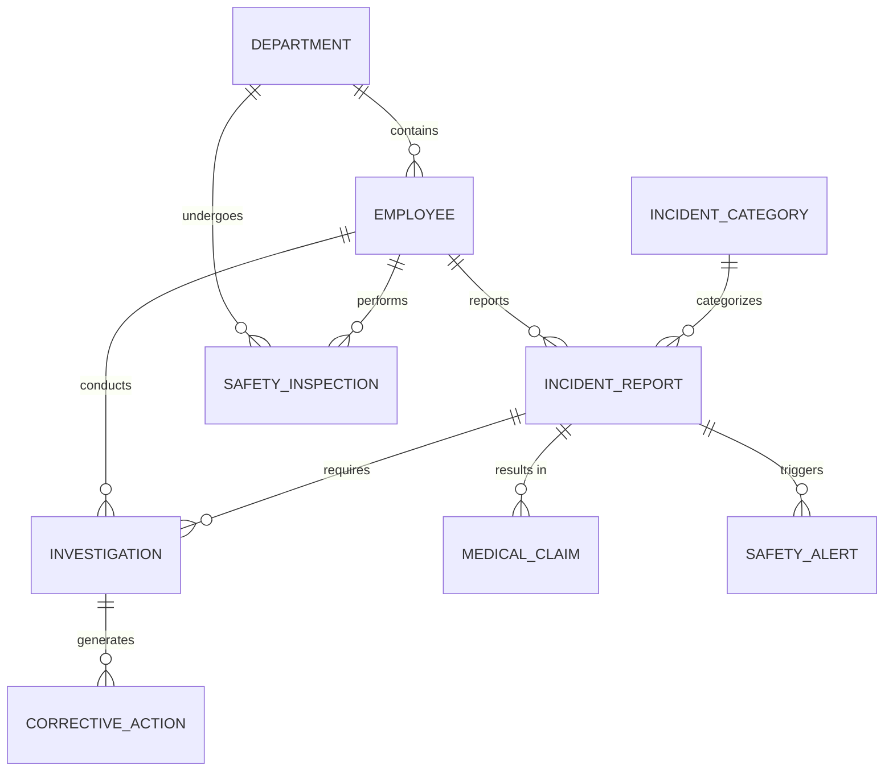

# Conceptual ERD — Health and Safety Incident Reporting System

## Mermaid Code

## Entity Description Table | Bang mo ta Entity

| # | Entity Name | Vietnamese Name | Description | Key Attributes | Main Relationships |
|---|-------------|-----------------|-------------|----------------|-------------------|
| 1 | DEPARTMENT | Phong ban | Cac phong ban trong cong ty | department_id, name | contains EMPLOYEE |
| 2 | EMPLOYEE | Nhan vien | Nhan vien trong he thong | employee_id, name, email | reports INCIDENT_REPORT |
| 3 | INCIDENT_REPORT | Bao cao su co | Thong tin chi tiet ve su co an toan | incident_id, date, status | requires INVESTIGATION |
| 4 | INCIDENT_CATEGORY | Loai su co | Danh muc phan loai cac su co | category_id, name, severity | categorizes INCIDENT_REPORT |
| 5 | INVESTIGATION | Ho so dieu tra | Thong tin dieu tra nguyen nhan | investigation_id, root_cause | generates CORRECTIVE_ACTION |
| 6 | CORRECTIVE_ACTION | Hanh dong khac phuc | Bien phap xu ly va ngan chan su co | action_id, deadline, status | belongs to INVESTIGATION |
| 7 | MEDICAL_CLAIM | Ho so boi thuong y te| Yeu cau thanh toan y te cho nguoi bi nan| claim_id, amount, status | belongs to INCIDENT_REPORT |
| 8 | SAFETY_INSPECTION | Bien ban kiem tra | Ghi nhan kiem tra an toan dinh ky | inspection_id, date, result | belongs to DEPARTMENT |
| 9 | SAFETY_ALERT | Canh bao an toan | Thong bao canh bao phat di sau su co | alert_id, message, date | belongs to INCIDENT_REPORT |

## Relationship Description | Mo ta Quan he

| # | From Entity | Cardinality | To Entity | Relationship Label | Business Explanation |
|---|-------------|-------------|-----------|-------------------|----------------------|
| 1 | DEPARTMENT | one-to-many | EMPLOYEE | contains | Mot phong ban bao gom nhieu nhan vien. |
| 2 | EMPLOYEE | one-to-many | INCIDENT_REPORT | reports | Mot nhan vien co the bao cao nhieu su co. |
| 3 | EMPLOYEE | one-to-many | INVESTIGATION | conducts | Mot nhan vien (Safety Officer) thuc hien nhieu cuoc dieu tra. |
| 4 | INCIDENT_CATEGORY | one-to-many | INCIDENT_REPORT | categorizes | Mot loai su co duoc phan loai cho nhieu bao cao su co khac nhau. |
| 5 | INCIDENT_REPORT | one-to-many | INVESTIGATION | requires | Mot su co co the yeu cau nhieu cuoc dieu tra. |
| 6 | INVESTIGATION | one-to-many | CORRECTIVE_ACTION | generates | Mot cuoc dieu tra sinh ra nhieu hanh dong khac phuc. |
| 7 | INCIDENT_REPORT | one-to-many | MEDICAL_CLAIM | results in | Mot su co co the dan den nhieu ho so boi thuong y te. |
| 8 | DEPARTMENT | one-to-many | SAFETY_INSPECTION | undergoes | Mot phong ban trai qua nhieu dot kiem tra an toan. |
| 9 | EMPLOYEE | one-to-many | SAFETY_INSPECTION | performs | Mot nhan vien thuc hien nhieu dot kiem tra an toan. |
| 10| INCIDENT_REPORT | one-to-many | SAFETY_ALERT | triggers | Mot su co the kich hoat nhieu canh bao an toan. |
