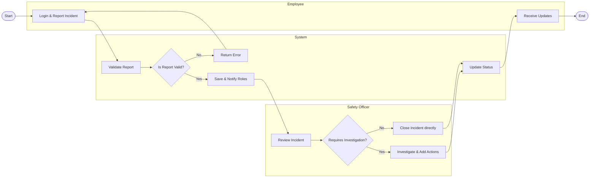

# Swimlane Diagram — Health and Safety Incident Reporting System

## Mermaid Code

## Flow Description | Mo ta luong

| Lane | Actor | Role in Flow |
|------|-------|-------------|
| 1 | Employee | Nguoi chu dong bao cao su co, nhap thong tin va nhan cap nhat ve qua trinh xu ly. |
| 2 | System | He thong kiem tra tinh hop le, luu tru, va thong bao cho cac ben lien quan. |
| 3 | Safety Officer | Nhan vien an toan tiep nhan bao cao, quyet dinh dieu tra hoac dong su co, va tao hanh dong khac phuc. |
