# Action Tree — Health and Safety Incident Reporting System

## Mermaid Code

```mermaid
%%{init: {'theme': 'default'}}%%
graph TD
    Root["Health and Safety Incident Reporting System"]

    Root --> M1["Incident Management"]
    Root --> M2["Investigation & Corrective Actions"]
    Root --> M3["Safety Inspections"]
    Root --> M4["Reporting & Analytics"]
    Root --> M5["Medical & Claims Management"]

    M1 --> A11["Report New Incident"]
    M1 --> A12["Track Incident Status"]
    M1 --> A13["Review Incident"]
    M1 --> A14["Broadcast Safety Alert"]

    M2 --> A21["Conduct Root Cause Analysis"]
    M2 --> A22["Assign Corrective Actions"]
    M2 --> A23["Monitor Action Progress"]
    M2 --> A24["Close Investigation"]

    M3 --> A31["Schedule Inspection"]
    M3 --> A32["Record Inspection Findings"]
    M3 --> A33["Manage Checklists"]

    M4 --> A41["Generate Compliance Report"]
    M4 --> A42["View Incident Dashboard"]
    M4 --> A43["Export OSHA Data"]

    M5 --> A51["Submit Medical Claim"]
    M5 --> A52["Track Claim Status"]
    M5 --> A53["Sync with Insurance"]
```

## Module Description | Mo ta Module

| # | Module | Description | Actions |
|---|--------|-------------|---------|
| 1 | Incident Management | Quan ly tiep nhan va phan loai cac su co ban dau | Report New Incident, Track Incident Status, Review Incident, Broadcast Safety Alert |
| 2 | Investigation & Corrective Actions | Quan ly qua trinh dieu tra nguyen nhan va khac phuc | Conduct Root Cause Analysis, Assign Corrective Actions, Monitor Action Progress, Close Investigation |
| 3 | Safety Inspections | Quan ly cac hoat dong kiem tra an toan dinh ky | Schedule Inspection, Record Inspection Findings, Manage Checklists |
| 4 | Reporting & Analytics | Bao cao thong ke, dashboard va du lieu compliance | Generate Compliance Report, View Incident Dashboard, Export OSHA Data |
| 5 | Medical & Claims Management | Quan ly yeu cau ho tro y te va bao hiem | Submit Medical Claim, Track Claim Status, Sync with Insurance |
