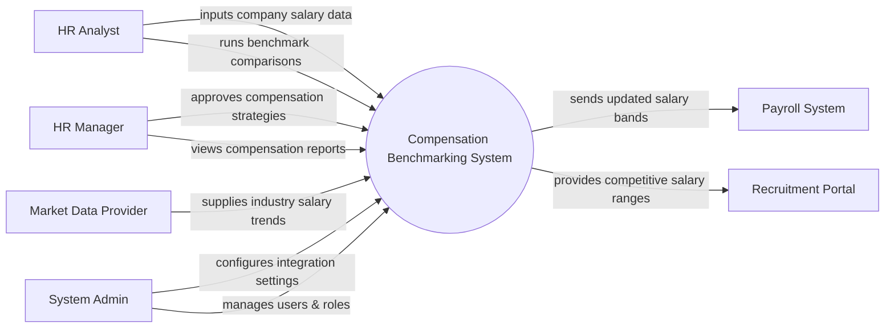

# Context Diagram — Compensation Benchmarking System

## Mermaid Code

## Actor & Interaction Table | Bang Actor & Tuong tac

| # | Actor | Actor Type | Data Sent TO System | Data Received FROM System | Notes |
|---|-------|------------|---------------------|---------------------------|-------|
| 1 | HR Analyst | Primary | Internal salary data, job descriptions | Benchmark reports, market comparisons | Nhan vien phan tich nhan su |
| 2 | HR Manager | Primary | Approval of compensation adjustments | Summary dashboards, compensation strategies | Quan ly nhan su |
| 3 | Market Data Provider | Supporting | Industry salary surveys, market trends | Subscription verifications | Cung cap du lieu thi truong |
| 4 | Payroll System | Supporting | Current employee salary data | Updated salary bands | He thong tinh luong |
| 5 | Recruitment Portal | Supporting | Candidate expected salary | Competitive salary ranges | He thong tuyen dung |
| 6 | System Admin | Primary | System configurations, user access rules | System logs, error alerts | Quan tri he thong |

## System Boundary Description | Mo ta Pham vi He thong

The Compensation Benchmarking System is designed to analyze and compare an organization's internal salary structures against external market data. It allows HR Analysts and HR Managers to make data-driven decisions regarding compensation strategies and salary bands. The system directly integrates with Market Data Providers to fetch industry trends, but it does not process actual payroll transactions or recruit candidates. Instead, it supplies the defined salary ranges to the internal Payroll System and Recruitment Portal.
