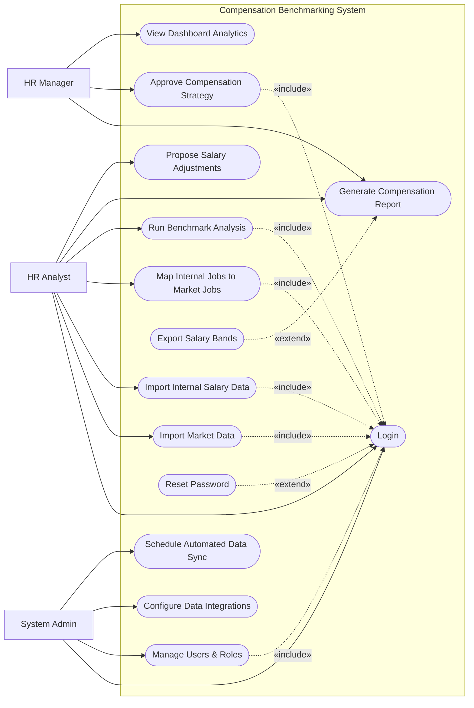

# Use Case Diagram — Compensation Benchmarking System

## Mermaid Code

## Actor Table | Bang Actor

| # | Actor | Actor Type | Role Description | Related Use Cases |
|---|-------|------------|------------------|-------------------|
| 1 | HR Analyst | Primary | Nhan vien phuc trach phan tich va nhap lieu luong | UC01, UC02, UC03, UC04, UC05, UC06, UC07 |
| 2 | HR Manager | Primary | Quan ly ra quyet dinh ve chien luoc thu lao | UC06, UC08, UC09 |
| 3 | System Admin | Primary | Quan tri vien he thong, phan quyen va cai dat ket noi | UC01, UC11, UC12, UC14 |

## Use Case Table | Bang Use Case

| # | UC ID | Use Case Name | Primary Actor | Secondary Actor | Description | Priority |
|---|-------|---------------|---------------|-----------------|-------------|----------|
| 1 | UC01 | Login | HR Analyst | | Authenticate user access | High |
| 2 | UC02 | Import Market Data | HR Analyst | Market Data Provider | Fetch external salary survey data | High |
| 3 | UC03 | Import Internal Salary Data | HR Analyst | Payroll System | Sync current company salaries | High |
| 4 | UC04 | Map Internal Jobs to Market Jobs | HR Analyst | | Align company roles with market standards | High |
| 5 | UC05 | Run Benchmark Analysis | HR Analyst | | Compare internal pay vs market pay | High |
| 6 | UC06 | Generate Compensation Report | HR Analyst | | Create detailed analysis reports | Medium |
| 7 | UC07 | Propose Salary Adjustments | HR Analyst | | Suggest changes to salary bands | Medium |
| 8 | UC08 | Approve Compensation Strategy | HR Manager | | Review and finalize compensation plans | High |
| 9 | UC09 | View Dashboard Analytics | HR Manager | | View high-level metrics and trends | Medium |
| 10| UC10 | Export Salary Bands | HR Analyst | | Download data for external systems | Low |
| 11| UC11 | Manage Users & Roles | System Admin | | Handle user accounts and permissions | High |
| 12| UC12 | Configure Data Integrations | System Admin | | Setup API connections with other systems | High |
| 13| UC13 | Reset Password | HR Analyst | | Recover account access | High |
| 14| UC14 | Schedule Automated Data Sync | System Admin | | Configure automated data imports | Medium |

## Use Case Specification | Dac ta Use Case

---

### UC01 — Login

| Field | Detail |
|-------|--------|
| **UC ID** | UC01 |
| **Use Case Name** | Login |
| **Actor(s)** | Primary: HR Analyst, HR Manager, System Admin |
| **Description** | Cho phep nguoi dung xac thuc de dang nhap vao he thong. |
| **Precondition** | 1. Nguoi dung phai co tai khoan hop le tren he thong.  2. He thong dang hoat dong binh thuong. |
| **Main Flow** | 1. Actor mo trang dang nhap.  2. System hien thi form dang nhap.  3. Actor nhap username va password.  4. Actor nhan nut Submit.  5. System xac thuc thong tin.  6. System chuyen huong den trang chu tuong ung quyen han. |
| **Alternative Flow** | **AF1** — Quen mat khau: Neu Actor chon "Forgot Password", System kich hoat UC13 Reset Password. |
| **Exception Flow** | **EX1** — Sai thong tin: Neu xac thuc that bai, System hien thi thong bao loi va yeu cau nhap lai.  **EX2** — Tai khoan bi khoa: Neu nhap sai qua 5 lan, System khoa tai khoan va thong bao lien he Admin. |
| **Postcondition** | Nguoi dung duoc dang nhap va phien lam viec duoc khoi tao. |
| **Business Rule** | **BR1**: Mat khau phai duoc ma hoa.  **BR2**: Phien dang nhap tu dong het han sau 30 phut khong hoat dong. |

---

### UC04 — Map Internal Jobs to Market Jobs

| Field | Detail |
|-------|--------|
| **UC ID** | UC04 |
| **Use Case Name** | Map Internal Jobs to Market Jobs |
| **Actor(s)** | Primary: HR Analyst |
| **Description** | Cho phep HR Analyst ghep noi cac vi tri cong viec noi bo voi cac chuc danh chuan tren thi truong. |
| **Precondition** | 1. HR Analyst da dang nhap (Include UC01).  2. He thong da co du lieu luong noi bo va du lieu thi truong. |
| **Main Flow** | 1. Actor chon chuc nang "Job Mapping".  2. System hien thi danh sach cac vi tri noi bo chua duoc ghep noi.  3. Actor chon mot vi tri noi bo.  4. System goi y cac chuc danh thi truong tuong dong.  5. Actor chon chuc danh thi truong phu phop va nhan "Map".  6. System luu lai lien ket va cap nhat trang thai vi tri. |
| **Alternative Flow** | **AF1** — Ghep noi thu cong: Neu khong co goi y phu hop, Actor co the tim kiem tu do chuc danh thi truong. |
| **Exception Flow** | **EX1** — Khong tim thay du lieu: Neu tap du lieu thi truong chua duoc import, System thong bao yeu cau import truoc. |
| **Postcondition** | Vi tri noi bo duoc lien ket thanh cong voi vi tri thi truong. |
| **Business Rule** | **BR1**: Mot vi tri noi bo chi co the ghep voi mot vi tri thi truong tai mot thoi diem benchmark.  **BR2**: Do trung khop cong viec phai dat toi thieu 70% theo tieu chuan danh gia. |

---

### UC05 — Run Benchmark Analysis

| Field | Detail |
|-------|--------|
| **UC ID** | UC05 |
| **Use Case Name** | Run Benchmark Analysis |
| **Actor(s)** | Primary: HR Analyst |
| **Description** | Thuc hien phan tich so sanh giua muc luong hien tai cua cong ty va muc luong tren thi truong. |
| **Precondition** | 1. HR Analyst da dang nhap (Include UC01).  2. Cac vi tri can phan tich da duoc ghep noi (UC04). |
| **Main Flow** | 1. Actor chon chuc nang "Run Analysis".  2. System hien thi form chon tieu chi (phong ban, muc do kinh nghiem, vi tri dia ly).  3. Actor chon cac tieu chi va nhan "Execute".  4. System tien hanh tinh toan cac chi so (Compa-ratio, Market Index).  5. System hien thi ket qua phan tich duoi dang bieu do va bang so lieu. |
| **Alternative Flow** | **AF1** — Luu cau hinh phan tich: O buoc 5, Actor co the chon "Save Configuration" de tai su dung cho lan sau. |
| **Exception Flow** | **EX1** — Loi tinh toan: Neu thieu du lieu luong noi bo cho mot so nhan vien, System bo qua ho va canh bao thieu du lieu. |
| **Postcondition** | Ket qua phan tich benchmark duoc tao va luu tru trong he thong. |
| **Business Rule** | **BR1**: Compa-ratio duoc tinh bang: Luong thuc te / Muc luong chuan thi truong (Mid-point).  **BR2**: Market Index duoc tinh de so sanh tong quy luong voi thi truong. |

---

### UC08 — Approve Compensation Strategy

| Field | Detail |
|-------|--------|
| **UC ID** | UC08 |
| **Use Case Name** | Approve Compensation Strategy |
| **Actor(s)** | Primary: HR Manager |
| **Description** | Quan ly HR xem xet va phe duyet hoac tu choi cac de xuat dieu chinh luong tu HR Analyst. |
| **Precondition** | 1. HR Manager da dang nhap (Include UC01).  2. Co it nhat mot de xuat dieu chinh dang cho duyet. |
| **Main Flow** | 1. Actor mo muc "Strategy Approvals".  2. System hien thi danh sach cac de xuat dieu chinh (Pending).  3. Actor chon mot de xuat de xem chi tiet (bao gom chi phi du kien tang them).  4. Actor nhan "Approve".  5. System cap nhat trang thai de xuat thanh "Approved".  6. System tu dong sinh ra cac dai luong (Salary Bands) moi va gui thong bao cho HR Analyst. |
| **Alternative Flow** | **AF1** — Tu choi: O buoc 4, Actor chon "Reject" va nhap ly do. System cap nhat trang thai "Rejected" va gui thong bao tra ve. |
| **Exception Flow** | **EX1** — Vuot ngan sach: Neu de xuat vuot qua ngan sach da cai dat, System hien thi canh bao mau do nhung van cho phep phe duyet neu co xac nhan bo sung. |
| **Postcondition** | De xuat dieu chinh luong duoc xu ly (Approved hoac Rejected). |
| **Business Rule** | **BR1**: Chi HR Manager tro len moi co quyen phe duyet.  **BR2**: Ngan sach du kien tang khong duoc vuot qua gioi han nam tru khi co su cho phep dac biet. |
