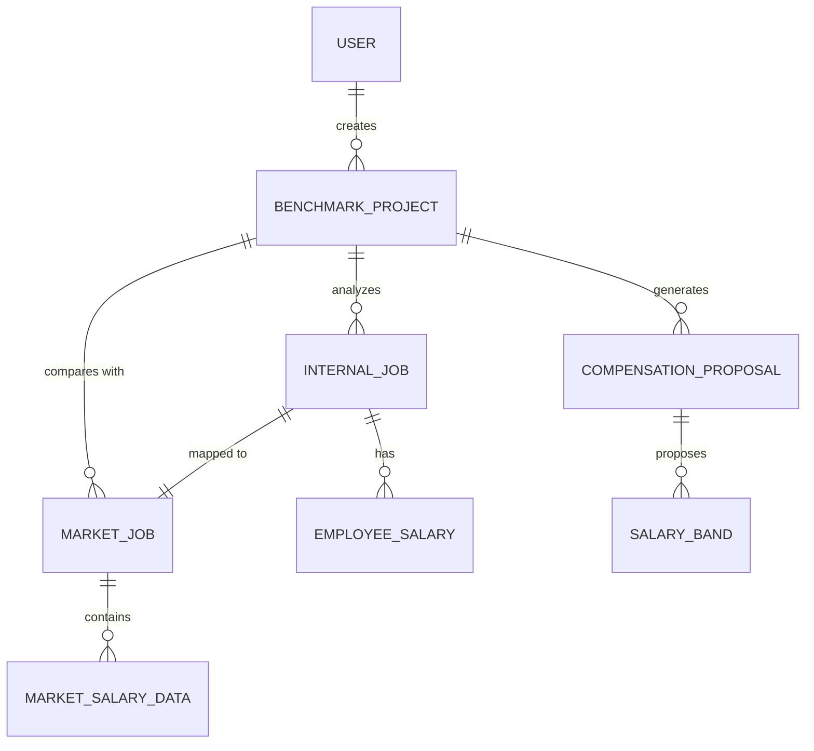

# Conceptual ERD — Compensation Benchmarking System

## Mermaid Code

## Entity Description Table | Bang mo ta Entity

| # | Entity Name | Vietnamese Name | Description | Key Attributes | Main Relationships |
|---|-------------|-----------------|-------------|----------------|-------------------|
| 1 | USER | Nguoi dung | Tai khoan nguoi dung he thong | user_id, role, name | creates BENCHMARK_PROJECT |
| 2 | BENCHMARK_PROJECT | Du an benchmark | Dot danh gia luong tong the | project_id, status, year | analyzes INTERNAL_JOB, compares with MARKET_JOB |
| 3 | INTERNAL_JOB | Vi tri noi bo | Chuc danh hien tai cua cong ty | job_id, title, department | mapped to MARKET_JOB, has EMPLOYEE_SALARY |
| 4 | MARKET_JOB | Vi tri thi truong | Chuc danh chuan tren thi truong | market_job_id, standard_title | contains MARKET_SALARY_DATA |
| 5 | EMPLOYEE_SALARY | Du lieu luong noi bo | Muc luong thuc te cua nhan vien | salary_id, base_pay, bonus | belongs to INTERNAL_JOB |
| 6 | MARKET_SALARY_DATA | Du lieu luong thi truong | Thong tin khao sat luong nganh | data_id, percentiles, region | belongs to MARKET_JOB |
| 7 | COMPENSATION_PROPOSAL | De xuat dieu chinh luong | Ke hoach thay doi cau truc luong | proposal_id, budget_impact | generates SALARY_BAND |
| 8 | SALARY_BAND | Dai luong | Muc luong toi thieu, trung binh, toi da | band_id, min_pay, max_pay | belongs to COMPENSATION_PROPOSAL |

## Relationship Description | Mo ta Quan he

| # | From Entity | Cardinality | To Entity | Relationship Label | Business Explanation |
|---|-------------|-------------|-----------|-------------------|----------------------|
| 1 | USER | one-to-many | BENCHMARK_PROJECT | creates | Mot nguoi dung (HR) co the tao nhieu dot benchmark. |
| 2 | BENCHMARK_PROJECT | one-to-many | INTERNAL_JOB | analyzes | Mot dot benchmark se phan tich nhieu vi tri noi bo. |
| 3 | BENCHMARK_PROJECT | one-to-many | MARKET_JOB | compares with | Mot dot benchmark se so sanh voi nhieu vi tri thi truong. |
| 4 | INTERNAL_JOB | one-to-one | MARKET_JOB | mapped to | Mot vi tri noi bo duoc map voi mot vi tri thi truong phu hop nhat. |
| 5 | INTERNAL_JOB | one-to-many | EMPLOYEE_SALARY | has | Mot vi tri noi bo gom nhieu muc luong thuc te cua cac nhan vien khac nhau. |
| 6 | MARKET_JOB | one-to-many | MARKET_SALARY_DATA | contains | Mot vi tri thi truong co nhieu muc luong tuy theo khu vuc hoac cap do. |
| 7 | BENCHMARK_PROJECT | one-to-many | COMPENSATION_PROPOSAL | generates | Ket qua benchmark se tao ra cac de xuat dieu chinh luong. |
| 8 | COMPENSATION_PROPOSAL | one-to-many | SALARY_BAND | proposes | Mot de xuat dieu chinh luong se bao gom nhieu dai luong moi. |
