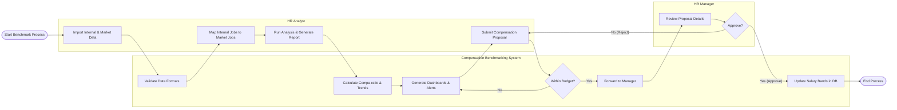

# Swimlane Diagram — Compensation Benchmarking System

## Mermaid Code

## Flow Description | Mo ta luong

| Lane | Actor | Role in Flow |
|------|-------|-------------|
| 1 | HR Analyst | Nguoi chiu trach nhiem thu thap du lieu, ghep noi vi tri va tao de xuat dieu chinh luong. |
| 2 | Compensation Benchmarking System | He thong kiem tra du lieu, tinh toan cac chi so benchmark, va quan ly luong phe duyet giua cac ben. |
| 3 | HR Manager | Nguoi quan ly xem xet de xuat va dua ra quyet dinh phe duyet cuoi cung cho viec ap dung dai luong moi. |
