# Action Tree — Compensation Benchmarking System

## Mermaid Code

```mermaid
%%{init: {'theme': 'default'}}%%
graph TD
    Root["Compensation Benchmarking System"]

    Root --> M1["Data Management"]
    Root --> M2["Job Mapping"]
    Root --> M3["Benchmarking & Analytics"]
    Root --> M4["Compensation Planning"]
    Root --> M5["System Administration"]

    M1 --> A11["Import Internal Salaries"]
    M1 --> A12["Import Market Survey Data"]
    M1 --> A13["Cleanse & Validate Data"]

    M2 --> A21["Match Job Titles"]
    M2 --> A22["Adjust Job Weights"]
    M2 --> A23["Approve Job Matches"]

    M3 --> A31["Calculate Compa-ratios"]
    M3 --> A32["Generate Gap Analysis"]
    M3 --> A33["View Dashboards"]

    M4 --> A41["Simulate Salary Increases"]
    M4 --> A42["Propose Salary Bands"]
    M4 --> A43["Approve Adjustments"]
    M4 --> A44["Export Approved Bands"]

    M5 --> A51["Manage Users"]
    M5 --> A52["Configure Integrations"]
    M5 --> A53["View Audit Logs"]
```

## Module Description | Mo ta Module

| # | Module | Description | Actions |
|---|--------|-------------|---------|
| 1 | Data Management | Quan ly du lieu dau vao tu noi bo va thi truong | Import Internal Salaries, Import Market Survey Data, Cleanse & Validate Data |
| 2 | Job Mapping | Ghep noi cac vi tri noi bo voi thi truong | Match Job Titles, Adjust Job Weights, Approve Job Matches |
| 3 | Benchmarking & Analytics | Phan tich so sanh va truc quan hoa du lieu | Calculate Compa-ratios, Generate Gap Analysis, View Dashboards |
| 4 | Compensation Planning | Hoach dinh va phe duyet dieu chinh luong | Simulate Salary Increases, Propose Salary Bands, Approve Adjustments, Export Approved Bands |
| 5 | System Administration | Quan tri tai khoan va cau hinh he thong | Manage Users, Configure Integrations, View Audit Logs |
