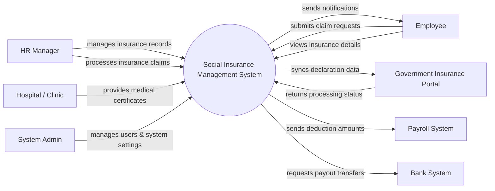

# Context Diagram — Social Insurance Management System

## Mermaid Code

## Actor & Interaction Table | Bang Actor & Tuong tac

| # | Actor | Actor Type | Data Sent TO System | Data Received FROM System | Notes |
|---|-------|------------|---------------------|---------------------------|-------|
| 1 | HR Manager | Primary | Insurance records, claim approvals, policy updates | Reports, claim statuses | Quan tri vien nhan su phu trach BHXH |
| 2 | Employee | Primary | Claim requests, personal information | Insurance details, notifications | Nhan vien trong cong ty |
| 3 | System Admin | Primary | System configurations, user roles | System logs, audit reports | Quan tri he thong |
| 4 | Government Insurance Portal | Regulatory | Processing statuses, policy guidelines | Insurance declaration data | Cong thong tin BHXH Dien tu |
| 5 | Payroll System | Supporting | Payroll confirmation status | Monthly insurance deductions | He thong tinh luong |
| 6 | Hospital / Clinic | Regulatory | Medical certificates, leave documents | Verification requests | Co so kham chua benh |
| 7 | Bank System | Supporting | Transaction statuses | Benefit payout requests | He thong ngan hang |

## System Boundary Description | Mo ta Pham vi He thong

The Social Insurance Management System handles the tracking, declaration, and processing of employee social insurance, health insurance, and unemployment insurance. It acts as an intermediary between the company's HR department, employees, and the Government Insurance Portal. The system does not directly process salary payments or medical treatments but integrates with external Payroll Systems and Hospitals for required data. It also allows the System Admin to manage users and access rights within the platform.
