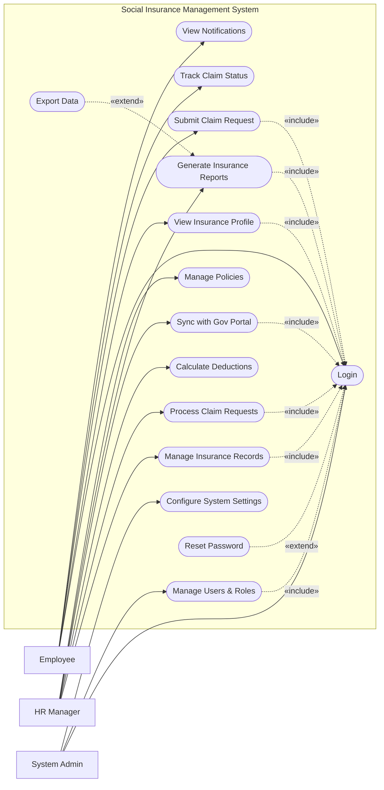

# Use Case Diagram — Social Insurance Management System

## Mermaid Code

## Actor Table | Bang Actor

| # | Actor | Actor Type | Role Description | Related Use Cases |
|---|-------|------------|------------------|-------------------|
| 1 | Employee | Primary | Nhan vien trong cong ty can quan ly bao hiem | UC01, UC02, UC03, UC04, UC11 |
| 2 | HR Manager | Primary | Chuyen vien nhan su phu trach che do bao hiem | UC05, UC06, UC07, UC08, UC09, UC10 |
| 3 | System Admin | Primary | Quan tri vien he thong | UC01, UC12, UC13 |

## Use Case Table | Bang Use Case

| # | UC ID | Use Case Name | Primary Actor | Secondary Actor | Description | Priority |
|---|-------|---------------|---------------|-----------------|-------------|----------|
| 1 | UC01 | Login | Employee | | Authenticate user access | High |
| 2 | UC02 | View Insurance Profile | Employee | | Xem thong tin so BHXH va qua trinh dong | Medium |
| 3 | UC03 | Submit Claim Request | Employee | | Nop ho so giai quyet che do (om dau, thai san...) | High |
| 4 | UC04 | Track Claim Status | Employee | | Theo doi tinh trang xu ly ho so | Medium |
| 5 | UC05 | Manage Insurance Records | HR Manager | | Quan ly qua trinh tham gia bao hiem cua nhan vien | High |
| 6 | UC06 | Process Claim Requests | HR Manager | | Tiep nhan va xu ly ho so huong che do | High |
| 7 | UC07 | Calculate Deductions | HR Manager | Payroll System | Tinh toan muc dong bao hiem hang thang | High |
| 8 | UC08 | Sync with Gov Portal | HR Manager | Gov Portal | Dong bo du lieu voi cong BHXH Quoc gia | High |
| 9 | UC09 | Generate Insurance Reports | HR Manager | | Xuat bao cao tang giam lao dong, chi phi | Medium |
| 10| UC10 | Manage Policies | HR Manager | | Cap nhat ty le dong va quy dinh moi | Medium |
| 11| UC11 | View Notifications | Employee | | Nhan thong bao ve bao hiem | Low |
| 12| UC12 | Manage Users & Roles | System Admin | | Quan ly tai khoan va phan quyen | High |
| 13| UC13 | Configure System Settings | System Admin | | Cai dat tham so he thong | Medium |
| 14| UC14 | Export Data | HR Manager | | Xuat file bao cao | Low |
| 15| UC15 | Reset Password | Employee | | Khoi phuc mat khau | High |

## Use Case Specification | Dac ta Use Case

---

### UC01 — Login

| Field | Detail |
|-------|--------|
| **UC ID** | UC01 |
| **Use Case Name** | Login |
| **Actor(s)** | Primary: Employee, HR Manager, System Admin |
| **Description** | Cho phep nguoi dung xac thuc de dang nhap vao he thong. |
| **Precondition** | 1. Nguoi dung co tai khoan tren he thong.  2. He thong hoat dong binh thuong. |
| **Main Flow** | 1. Actor mo trang dang nhap.  2. System hien thi form dang nhap.  3. Actor nhap username va password.  4. Actor nhan Submit.  5. System xac thuc thong tin.  6. System chuyen huong vao trang chu tuong ung. |
| **Alternative Flow** | **AF1** — Quen mat khau: Actor chon "Forgot Password", System goi UC15. |
| **Exception Flow** | **EX1** — Sai thong tin: System bao loi va yeu cau nhap lai.  **EX2** — Tai khoan khoa: System bao loi va yeu cau lien he Admin. |
| **Postcondition** | Phien dang nhap duoc tao. |
| **Business Rule** | **BR1**: Password ma hoa.  **BR2**: Het han sau 30 phut khong tuong tac. |

---

### UC03 — Submit Claim Request

| Field | Detail |
|-------|--------|
| **UC ID** | UC03 |
| **Use Case Name** | Submit Claim Request |
| **Actor(s)** | Primary: Employee |
| **Description** | Nhan vien nop ho so xin huong che do bao hiem (om dau, thai san...). |
| **Precondition** | 1. Da dang nhap.  2. Co du dieu kien de huong che do. |
| **Main Flow** | 1. Actor chon "Submit Claim".  2. System hien thi form va yeu cau chon loai che do.  3. Actor dien thong tin va tai len chung tu y te.  4. Actor nhan Submit.  5. System kiem tra tinh hop le.  6. System luu ho so va thong bao den HR Manager. |
| **Alternative Flow** | **AF1** — Luu nhap: Actor chon "Save Draft" o buoc 4, System luu tam thoi. |
| **Exception Flow** | **EX1** — Thieu chung tu: System bao loi yeu cau tai len file bat buoc.  **EX2** — Qua han: System thong bao ho so da qua han nop theo quy dinh. |
| **Postcondition** | Ho so luu o trang thai "Pending". |
| **Business Rule** | **BR1**: Phai co chung tu hop le.  **BR2**: Ngay xin huong khong vuot qua gioi han quy dinh. |

---

### UC06 — Process Claim Requests

| Field | Detail |
|-------|--------|
| **UC ID** | UC06 |
| **Use Case Name** | Process Claim Requests |
| **Actor(s)** | Primary: HR Manager |
| **Description** | HR Manager xu ly ho so che do cua nhan vien. |
| **Precondition** | 1. Da dang nhap.  2. Co ho so dang o trang thai Pending. |
| **Main Flow** | 1. Actor chon "Claim Requests".  2. System hien thi danh sach ho so Pending.  3. Actor chon xem chi tiet mot ho so.  4. Actor kiem tra chung tu y te va thong tin.  5. Actor nhan "Approve".  6. System cap nhat trang thai, cho phep chuyen len Co quan BHXH. |
| **Alternative Flow** | **AF1** — Tu choi: Actor nhan "Reject" va nhap ly do. |
| **Exception Flow** | **EX1** — Ho so da bi xoa: System bao loi ho so khong con ton tai. |
| **Postcondition** | Trang thai ho so thanh "Approved" hoac "Rejected". |
| **Business Rule** | **BR1**: Chi HR Manager moi duoc duyet. |

---

### UC08 — Sync with Gov Portal

| Field | Detail |
|-------|--------|
| **UC ID** | UC08 |
| **Use Case Name** | Sync with Gov Portal |
| **Actor(s)** | Primary: HR Manager, Secondary: Gov Portal |
| **Description** | Dong bo du lieu tang giam va ho so voi co quan BHXH. |
| **Precondition** | 1. Da dang nhap.  2. Chu ky so hop le. |
| **Main Flow** | 1. Actor chon "Sync with Gov Portal".  2. System tong hop ho so da duyet va lap to khai.  3. Actor chon ky so va gui.  4. System ket noi voi Gov Portal.  5. Gov Portal tiep nhan va tra ve ma bien nhan.  6. System luu ma bien nhan va cap nhat trang thai "Submitted". |
| **Alternative Flow** | **AF1** — Xem ket qua: Actor kiem tra trang thai sau khi gui. |
| **Exception Flow** | **EX1** — Loi ket noi: System bao loi mang va yeu cau thu lai.  **EX2** — Loi chu ky so: System thong bao chu ky so het han hoac khong hop le. |
| **Postcondition** | Du lieu duoc gui di thanh cong. |
| **Business Rule** | **BR1**: Bat buoc phai co chu ky so hop le cua doanh nghiep. |
