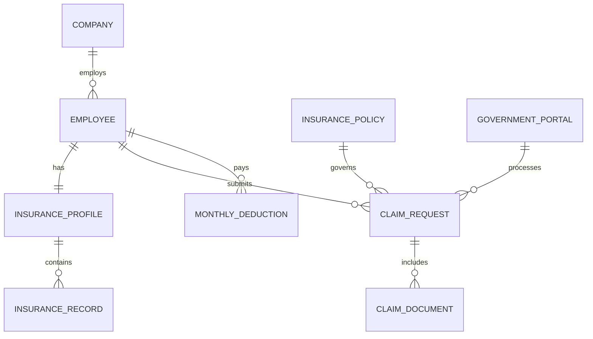

# Conceptual ERD — Social Insurance Management System

## Mermaid Code

## Entity Description Table | Bang mo ta Entity

| # | Entity Name | Vietnamese Name | Description | Key Attributes | Main Relationships |
|---|-------------|-----------------|-------------|----------------|-------------------|
| 1 | COMPANY | Cong ty | Thong tin doanh nghiep tham gia bao hiem | company_id, name, tax_code | employs EMPLOYEE |
| 2 | EMPLOYEE | Nhan vien | Nhan vien cong ty dong bao hiem | employee_id, name, identity_card | has INSURANCE_PROFILE |
| 3 | INSURANCE_PROFILE | So bao hiem | Thong tin so BHXH cua nhan vien | profile_id, insurance_number | contains INSURANCE_RECORD |
| 4 | INSURANCE_RECORD | Qua trinh dong | Lich su dong bao hiem tung thoi ky | record_id, period, salary_basis | belongs to INSURANCE_PROFILE |
| 5 | CLAIM_REQUEST | Ho so che do | Don xin huong che do (om dau, thai san) | request_id, claim_type, status | submits by EMPLOYEE |
| 6 | CLAIM_DOCUMENT | Chung tu | Ho so, giay to y te kem theo ho so che do | document_id, file_url, doc_type | includes by CLAIM_REQUEST |
| 7 | MONTHLY_DEDUCTION | Muc tru luong | So tien trich nop tu luong hang thang | deduction_id, amount, month | pays by EMPLOYEE |
| 8 | INSURANCE_POLICY | Chinh sach bao hiem | Ty le dong va quy dinh cua nha nuoc | policy_id, policy_name, rate | governs CLAIM_REQUEST |
| 9 | GOVERNMENT_PORTAL | Cong BHXH | Co quan tiep nhan va xu ly ho so | portal_id, endpoint | processes CLAIM_REQUEST |

## Relationship Description | Mo ta Quan he

| # | From Entity | Cardinality | To Entity | Relationship Label | Business Explanation |
|---|-------------|-------------|-----------|-------------------|----------------------|
| 1 | COMPANY | one-to-many | EMPLOYEE | employs | Mot cong ty co nhieu nhan vien tham gia bao hiem. |
| 2 | EMPLOYEE | one-to-one | INSURANCE_PROFILE | has | Moi nhan vien co mot ho so/so bao hiem duy nhat. |
| 3 | INSURANCE_PROFILE | one-to-many | INSURANCE_RECORD | contains | Mot ho so bao hiem co nhieu giai doan dong bao hiem. |
| 4 | EMPLOYEE | one-to-many | CLAIM_REQUEST | submits | Mot nhan vien co the nop nhieu ho so che do khac nhau. |
| 5 | CLAIM_REQUEST | one-to-many | CLAIM_DOCUMENT | includes | Mot ho so che do co the bao gom nhieu chung tu y te kem theo. |
| 6 | EMPLOYEE | one-to-many | MONTHLY_DEDUCTION | pays | Mot nhan vien co nhieu khoan tru nop bao hiem hang thang. |
| 7 | INSURANCE_POLICY | one-to-many | CLAIM_REQUEST | governs | Mot chinh sach bao hiem quy dinh nhieu ho so che do. |
| 8 | GOVERNMENT_PORTAL | one-to-many | CLAIM_REQUEST | processes | Cong BHXH tiep nhan va xu ly nhieu ho so che do tu doanh nghiep. |
